<h1 style="text-align: center;">明日から使える！海外コンペで評価された<br>アクセシビリティ実装ガイド</h1>

<div class="author-info">
  <div class="profile-container">
    
    <div class="profile-text-area">
      <div class="profile-text-main" style="text-align: center;">Sansan株式会社<br>#akidon0000 (あきどん)</div>
    </div>
  </div>
</div>

---

**誰もが・どんな状況でも、必要とする情報に辿り着けること**——それがアクセシビリティ対応の本質だと私は考えています。視覚や聴覚といった身体特性はもちろん、画面の向きやデバイスの違いまで、利用者の置かれた状況はさまざまです。いかなる状況であっても情報に辿り着けるようにする。アクセシビリティ対応は一部のユーザーだけのための特別な対応ではなく、すべての人の使いやすさに直結する「アプリの実装品質」と捉えると良いかもしれません。

iOSには、VoiceOverやDynamic Type、Voice Controlといった強力な支援技術が標準で備わっています。これらは、開発側が意識して対応してこそ、その力を最大限に発揮します。さらに、タップ領域の広さやコントラストのように、標準の支援技術だけでは満たせず、実装側でしか担保できない領域もあります。

本記事では、著者が iOSDevUK カンファレンスの Accessibility Challenge コンペ で優勝した実装を元に、AppleのHuman Interface Guidelinesに沿ってアクセシビリティの解説をします。

## 題材資料：iOSDevUK Accessibility Challenge

<figure style="float: left; margin: 0 20px 8px 0; text-align: center; display: inline-block;">
  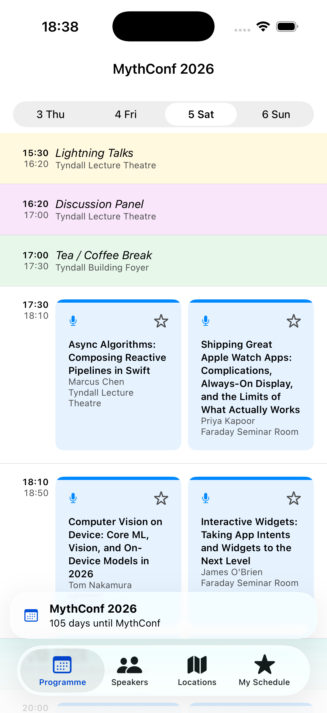
  <figcaption style="font-size: 0.7em; color: #555;">MythConfのProgramme画面</figcaption>
</figure>

iOSDevUK Accessibility Challengeは、MythConf という架空カンファレンスアプリを題材にアクセシビリティの向上を競うコンペティションです。このアプリはProgramme、Speakers、Locations、My Scheduleの4タブを持ち、アクセシビリティの観点で改善できる箇所が多数存在していました。

最初にVoiceOverをオンにして題材アプリを触ると、セッションカードは断片的な単語を何度も読み上げ、地
図へ入ると操作に迷い、最大文字サイズでは会場名が画面からこぼれました。見た目には完成しているアプ
リが、使い方を変えた瞬間に別物になったのです。

誰もが・どんな状況でも、必要とする情報に辿り着けること。このアプリを、画面を見なくても、細かなタップが難しくても、必要な情報へ辿り着ける状態に直す——それが今回挑戦したアクセシビリティコンペでした。

優勝した際は、主催のRobin 氏から次の評価をいただきました。

> We had some great pull requests, but his was our favorite.
<div style="clear: both;"></div>
Appleはアクセシビリティ対応のガイドラインを、利用者の特性に応じて大きく5つの領域に分けて定義しており、これは今回の題材としたコンペの評価軸でもありました。本記事も主にこの5つを地図として進めますが、これがすべてではなく、ここに収まりきらない観点も存在します。

- **Vision（視覚）**：見えづらくても情報が伝わるように。
- **Mobility（身体機能）**：細かな操作が難しくても扱えるように。
- **Cognitive（認知）**：迷わず理解できるように。
- **Hearing（聴覚）**：聞こえなくても気づけるように。
- **Speech（発話）**：声を使わなくても操作できるように。

## Vision｜文字サイズに追従する：Dynamic Type

文字サイズの追従は、アクセシビリティ対応の基本といえるでしょう。ユーザーが設定アプリで文字サイズを上げると、`.body` などのテキストスタイルを使っている箇所は自動で拡大されます。このとき考慮すべきなのが、**レイアウトの変化** と **情報量の変化** の2つです。

### レイアウトの変化に対応する

文字サイズが大きくなった際の簡単な対策は「横に収まらなければ縦に積む」ことです。ここで使うのが `ViewThatFits` です。`ViewThatFits` は与えた候補を上から試し、収まる最初のものを採用します。文字サイズの境界（AX1）を待たず、実際にはみ出した瞬間に縦積みへ切り替わるのがポイントです。

> ViewThatFitsは、HStackやVStackなどビューが変化したとしてもビューが作り直されることはなく、パフォーマンスの低下を防ぐことができます。

```swift
// 時刻と会場：横に入らなければ自動で縦積みに切り替わる
ViewThatFits(in: .horizontal) {
    HStack {
        Label(session.timeRange, systemImage: "clock")
        Spacer()
        NavigationLink(value: locationID) { locationLinkLabel }
    }
    VStack(alignment: .leading) {
        Label(session.timeRange, systemImage: "clock")
        NavigationLink(value: locationID) { locationLinkLabel }
    }
}
```

<div style="display: flex; gap: 10px; justify-content: center; align-items: flex-start;">
  <figure style="margin: 0; text-align: center; flex: 1;">
    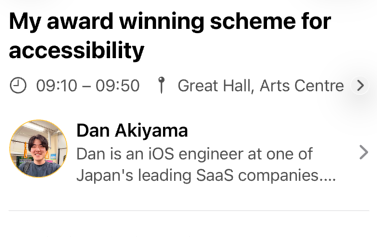
    <figcaption style="font-size: 0.7em; color: #555;">横に収まる場合：HStack</figcaption>
  </figure>
  <figure style="margin: 0; text-align: center; flex: 1;">
    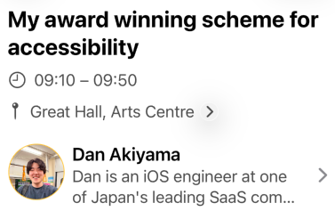
    <figcaption style="font-size: 0.7em; color: #555;">収まらない場合：VStackへ</figcaption>
  </figure>
</div>

#### 文字以外もサイズ変化に追従する `@ScaledMetric`

文字サイズに追従するのは「文字」だけではありません。アイコンのサイズ、余白、そして後述するタップ領域も変化させる必要があります。その際には、`@ScaledMetric` が活用できます。

```swift
@ScaledMetric private var starIconSize: CGFloat = 18
@ScaledMetric private var tapButtonSize: CGFloat = 44
```


### 情報量の変化に対応する

`lineLimit` を使って行数を固定にしている場合、文字サイズによって文字の表示量が変化しユーザーがその画面で得られる情報量に変化が発生する懸念があります。その際には文字サイズに応じて行数を変化させることも検討してみると良いかもしれません。`@Environment(\.dynamicTypeSize)` を見て、見切れを減らしつつ通常時のレイアウトも保つことが可能です。

<div style="display: flex; gap: 10px; justify-content: center; align-items: flex-start;">
  <figure style="margin: 0; text-align: center; flex: 1;">
    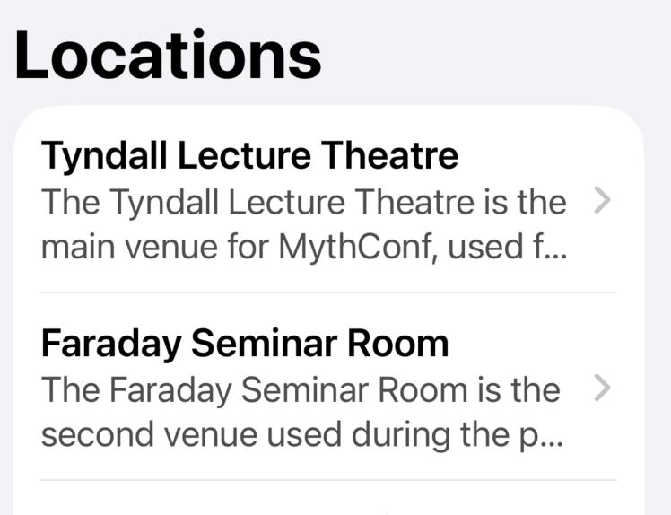
    <figcaption style="font-size: 0.7em; color: #555;">文字サイズ最小（xSmall）での表示</figcaption>
  </figure>
  <figure style="margin: 0; text-align: center; flex: 1;">
    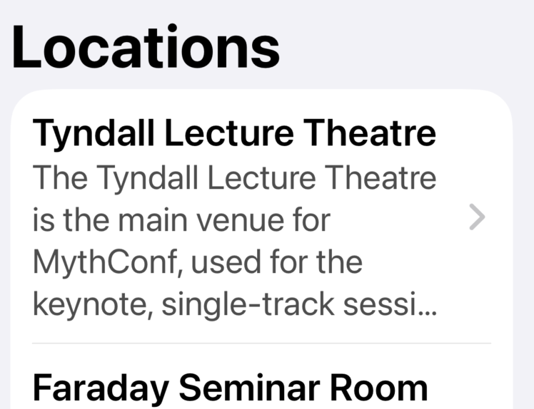
    <figcaption style="font-size: 0.7em; color: #555;">最大サイズ（AX5）では行数を増やして見切れを防ぐ</figcaption>
  </figure>
</div>

```swift
extension View {
    /// Accessibility サイズ (AX1+) では行数を増やして見切れを防ぐ
    func a11yLineLimit(_ standard: Int, extra: Int = 2) -> some View {
        modifier(A11yLineLimitModifier(standard: standard, extra: extra))
    }
}

private struct A11yLineLimitModifier: ViewModifier {
    @Environment(\.dynamicTypeSize) private var dynamicTypeSize
    let standard: Int
    let extra: Int

    func body(content: Content) -> some View {
        content.lineLimit(dynamicTypeSize.isAccessibilitySize ? standard + extra : standard)
    }
}
```

#### 文字サイズの変化を許容できない際のベストプラクティス

<figure style="float: right; margin: 0 0 8px 20px; text-align: center; display: inline-block;">
  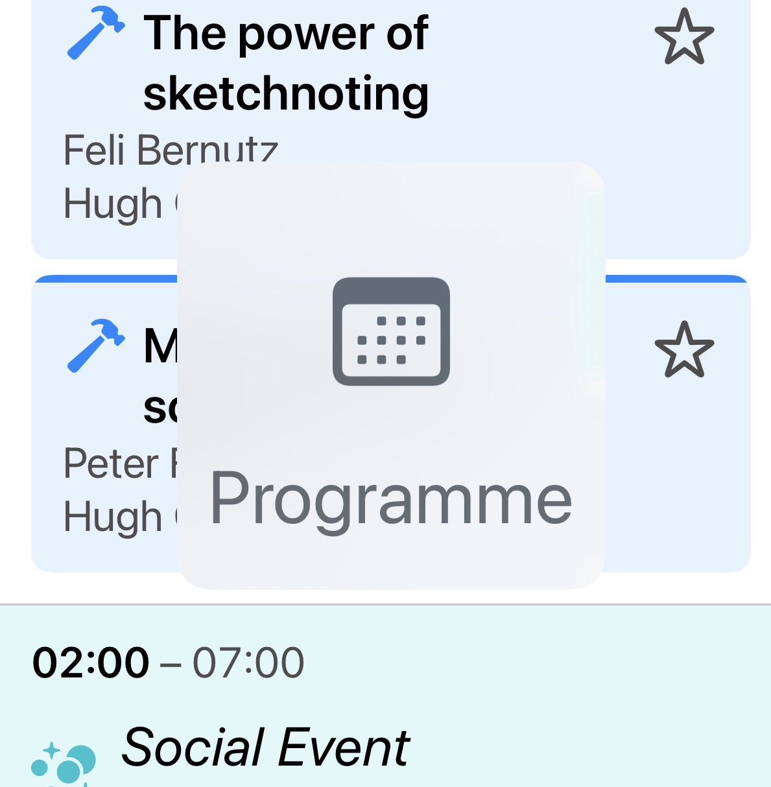
  <figcaption style="font-size: 0.7em; color: #555;">長押しで拡大ラベルをHUD表示（レイアウトは維持）</figcaption>
</figure>

タブバーやツールバーのように、デザイン上どうしても文字・アイコンを拡大できない要素もあります。とはいえ「小さいまま放置」では、拡大表示を必要とするユーザーがその要素を読めません。そこで活用できるのが **Large Content Viewer** です。

Large Content Viewerは、アクセシビリティサイズ設定時に対象要素を**長押し**すると、画面中央に拡大したアイコンとラベルをHUDとしてオーバーレイ表示する仕組みです。自前で作ったカスタムコントロールは自動では対応しないため`.accessibilityShowsLargeContentViewer` で拡大時に見せる内容を明示的に渡す必要があります。

<div style="clear: both;"></div>

## Vision｜画面を見ずに音で操作する：VoiceOver

VoiceOverは、画面を見ずにアプリを操作するためのスクリーンリーダーです。ただし「よしなに読み上げてくれる便利機能」ではなく、何も設計しなければボタンはただ「ボタン」としか読まれません。音は目に比べて情報密度が圧倒的に低いため、何を補い何を読み上げないかを取捨選択し、限られた音の帯域を最大限に活かすことが対応の肝になります。

- **URLは「種類」を先に伝える**：スピーカー詳細にあるGitHubやXなどのプロフィールリンクは、URLをそのまま読ませると「https://github.com/akidon0000」と聞き取りづらくなります。ホストとパスを解析し、`accessibilityLabel` を「GitHubアカウント、akidon0000」と組み立てれば、情報量を減らし伝えることが可能です。
- **バラバラの要素は1つにまとめる**：1件のセッションを表すカード（タイトル・スピーカー・会場などが集まったもの）は、要素ごとにバラバラ読み上げるより、`.accessibilityElement(children: .combine)` で1つにまとめた方が圧倒的に速く理解できます。
- **読み上げ順は「結論から」**：`.accessibilitySortPriority` で順序を制御します。MythConfのカードでは「種別 → タイトル → スピーカー → 会場 → お気に入り」の順にし、長くなりがちなタイトルより先に「これはWorkshopだ／Talkだ」と分かるようにしました。聞き手の負担が小さくなります。

```swift
VStack(spacing: 0) { // TODO 上記のやつとコードの内容が乖離
    Image(systemName: iconName)
        .accessibilityHidden(true) // 装飾は読み上げから除外

    FavouriteButtonView(talk: talk)
        .accessibilitySortPriority(0) // 最後に読む

    NavigationLink(value: reference) {
        /** HogeHoge **/
    }
    // 「種別, タイトル, by スピーカー, at 会場」を1フレーズに
    .accessibilityLabel("\(kind),\(title),by\(speakers),at\(location)")
    .accessibilitySortPriority(1) // 先に読む
}
.accessibilityElement(children: .contain) // コンテンツをそれぞれ独立した操作に
```

### 状態が変化した時に、変化後の状態を知らせる

お気に入りのように状態がトグルする要素は、`accessibilityLabel` を**現在の状態に応じて出し分け**ます。こうすると、トグル後にVoiceOverが読み直され、最新の状態を耳で確認することができます。

**文言そのものにもこだわりましょう**。状態（オン／オフ）ではなく「押したら何が起きるか」を伝えるべきです。VoiceOverはボタンに自動で「ボタン」と読み添えるため、未追加は「Favourite, ボタン」と読まれ、**押せばFavouriteできる**と直感的に伝わります。追加済みの場合は `"Remove session from favourites"`とすることで、短くても意味が通るようになります。

加えて `.sensoryFeedback(.success, trigger: isFavourite)` で、音が聞こえない環境でも触覚で切り替わりが伝わります。

```swift
Button {
    isFavourite ? viewModel.removeFavourite(talk: talk)
                : viewModel.addFavourite(talk: talk)
} label: {
    Image(systemName: isFavourite ? "star.fill" : "star")
        .foregroundStyle(isFavourite ? .yellow : .textSecondary)
}
.accessibilityLabel(isFavourite ? Text("Remove session from favourites")
                                : Text("Favourite"))
.sensoryFeedback(.success, trigger: isFavourite)
```

### 地図はApple Mapsに丸投げする

<figure style="float: right; margin: 0 0 8px 20px; text-align: center; display: inline-block;">
  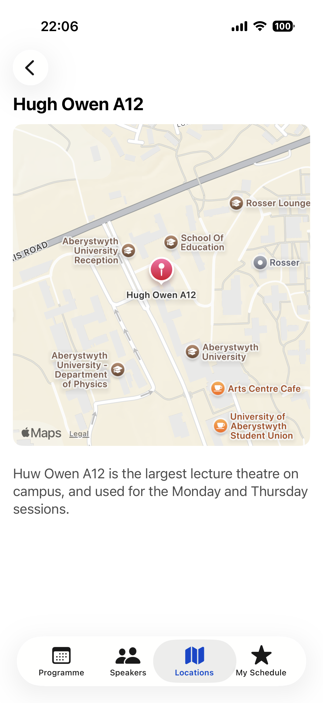
  <figcaption style="font-size: 0.7em; color: #555;">会場詳細の地図（タップでApple Mapsへ）</figcaption>
</figure>

SwiftUIの `Map` は、VoiceOverではピンやズームの読み上げが事実上操作不能で、手が止まってしまいます。そこで **VoiceOver上では地図を「Apple Mapsを開く1つのボタン」に置き換え**ました。`accessibilityRepresentation` を使えば、見た目はインタラクティブな地図のまま、支援技術にだけ別の表現を渡せます。晴眼ユーザーには通常の地図、VoiceOver／Switch Controlユーザーには使い慣れたApple Mapsへ。どちらの体験も犠牲にせず、地図は純正に任せるのが最善だと考えています。

<div style="clear: both;"></div>

```swift
LocationMapView(location: location, coordinate: coordinate)
  .accessibilityRepresentation {
    Button("") { openInMaps() }
      .accessibilityLabel(Text("Open in Maps: \(location.name)"))
      .accessibilityInputLabels(["Map", "Directions", location.name])
}
```


## Vision｜色による視認性

コントラスト比はコンパイルエラーも出ず気づきにくいため、Xcode付属の **Accessibility Inspector**（Xcode → Open Developer Tool）で実測しましょう。指標には **Web Content Accessibility Guidelines (WCAG)** が広く使われており、本文テキストは **4.5:1**、UI部品や大きな文字は **3:1** 以上が推奨されています。

### システムカラーだからOKではない
`.foregroundStyle(.secondary)`、便利ですよね——実測するまでは。システムの `.secondary` は白背景で約 **3.44:1** と、本文テキストのAA（4.5:1）に届きません。`.yellow`・`.mint` も白背景では **約1.5:1**・**約2.4:1** と、UI部品の下限3:1の半分しかありません。「Appleの色だから大丈夫」は必ずしも成り立たないのです。今回はコンテストということもあり色味の印象を保ったままAA以上を満たす独自トークンへ置き換えましたが、実際にどこまで対応すべきかはチームで共通認識をそろえておくのが良さそうです。

### 状態は色だけでなく「形」でも伝える

状態を色だけで示すのは避けたいところです。下の星は黄色を判別しづらいと状態が伝わりづらい可能性があります。そこで形の変化に加え、アニメーションやハプティクスでも補いました。

<div style="display: flex; gap: 12px; justify-content: center; align-items: flex-start; flex-wrap: wrap;">
  <figure style="margin: 0; text-align: center;">
    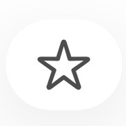
    <figcaption style="font-size: 0.7em; color: #555;">カラー・オフ</figcaption>
  </figure>
  <figure style="margin: 0; text-align: center;">
    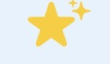
    <figcaption style="font-size: 0.7em; color: #555;">カラー・オン</figcaption>
  </figure>
  <figure style="margin: 0; text-align: center;">
    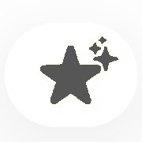
    <figcaption style="font-size: 0.7em; color: #555;">白黒・オン</figcaption>
  </figure>
</div>


## Vision & Cognitive｜「押せる」と気づかせる

「押せるかどうかを考えさせない」「押した結果に驚かせない」操作できることを形や色であらかじめ明示しておくことも、非常に重要です。

> URLやボタンの色によく青色が使われている理由については、 [なぜデフォルトが青色！？ Tint Colorの理由に迫る by akidon0000 (iOSDC Japan 2024 ルーキーズLT)] で詳しく話しています。

<div style="display: flex; gap: 10px; justify-content: center; align-items: flex-start;">
  <figure style="margin: 0; text-align: center; flex: 1;">
    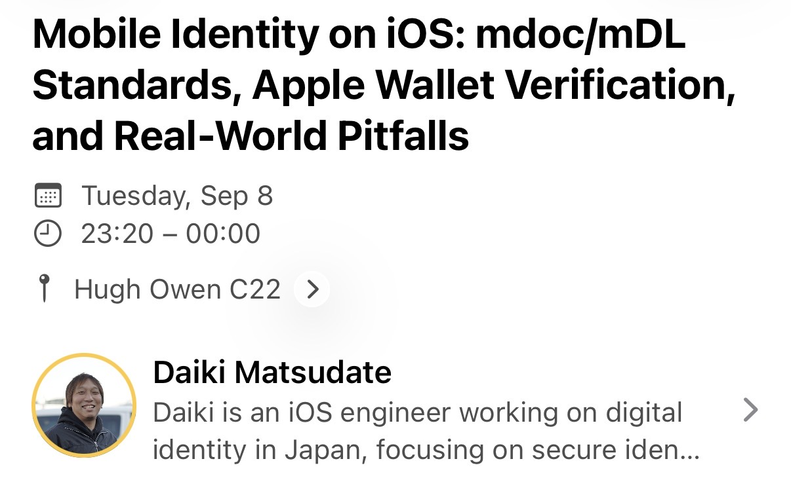
    <figcaption style="font-size: 0.7em; color: #555;">chevronで「タップで遷移」を予告</figcaption>
  </figure>
  <figure style="margin: 0; text-align: center; flex: 1;">
    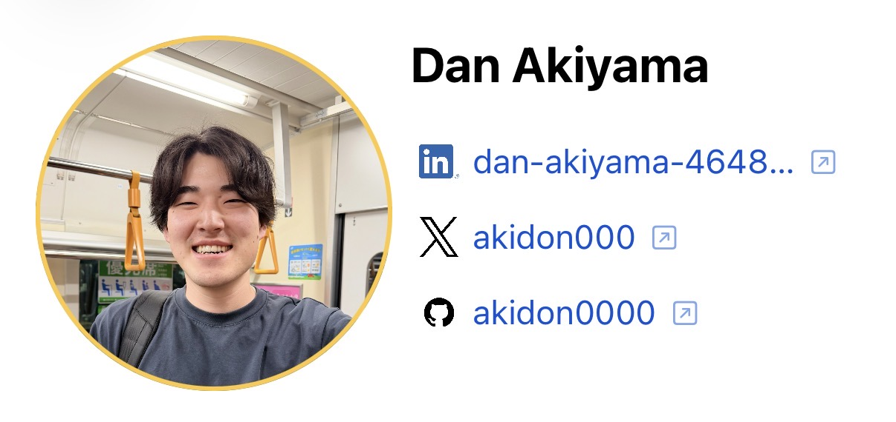
    <figcaption style="font-size: 0.7em; color: #555;">外部リンクは矢印アイコンで予告</figcaption>
  </figure>
</div>


## その他のやったこと

残りの領域も、「どんな状況でも情報に辿り着ける」ために という思想で対応しました。

- **Mobility｜タップ領域は44×44pt以上**：アイコンが小さくても当たり判定は44pt確保し、透明部分まで反応させる。文字サイズの拡大にも連動させる。
- **Mobility｜ジェスチャには必ず代替を**：日付切り替えはピッカー＋左右スワイプ、画面端スワイプ戻るも有効化し、「ジェスチャ限定の操作」を作らない。
- **Speech / Mobility｜キーボードだけで全機能を操作**：Full Keyboard Access で端から端まで到達可能に。
  - `⌘1〜4` でタブ移動、`⌘F` で検索、`⌘D` でお気に入りトグル。星までTab連打せず保存できる。
- **Cognitive｜語彙と表示の一貫性**：同じ操作は同じ言葉（Favourite / Save、Open in Maps）。タブは日付＋曜日の「3 Thu」と表記。
- **Cognitive｜細部の読み上げ**：件数は「1 session／3 sessions」と複数形を出し分ける。
- **Cognitive｜Reduce Motion／自動で消えるUIを作らない**：オン時はアニメーションをを静的表示にする。シート・アラート・バナーは必ずユーザー操作で閉じる仕組みへ。
- **Hearing｜音に触覚を添える**：お気に入りの切り替えに成功ハプティクスを添え、音が聞こえなくても成否が伝わるように。
- **Speech / Switch Control｜手数を減らす**：地図を「Open in Maps」の単一ボタンに畳み、要素をまとめて読み上げ順も整理。
- **Vision / Mobility｜横向き対応**：横向きではナビバーを隠して縦の画素をコンテンツへ回す。会場詳細は地図と説明を左右2カラムに切り替え、縦に戻せば元に戻る仕組みへ。
- **Speech｜Voice Controlは「言いそうな言葉」を全部登録**：表示文字と違う言い方でも呼び出せるよう、言い換え候補をまとめて登録する。お気に入りの星は英米スペル違い（Favourite / Favorite）や「Star」「Bookmark」「Save」、日付ピッカーは「Thursday」「Day 1」、SNSリンクは「Tweet」やBlueskyの俗称「Skeet」まで。言いそうな言葉を先回りするほど音声操作は滑らかになる。

```swift
// お気に入りの星：英米スペル違いや同義語をまとめて登録
.accessibilityInputLabels([
    "Favourite", "Favorite", "Star", "Bookmark",
    "Save", "Add to schedule", "Remove from schedule"
])
// 日付タブ：見たまま + 省略形 + 「Day N」を全部受け付ける
.accessibilityInputLabels([
    "3 Thursday", "3 Thu", "Thursday", "Thu", "Day 1"
])
```

また以下は厳密にはアクセシビリティとは呼べないかもしれません。しかし「誰もが情報へ容易に辿り着ける」という同じ思想のもとで実装した、枠を超えたUX向上です。

- **オフライン会場地図**：地図画像をキャッシュし、オフライン検知でキャッシュ画像へ差し替え。
- **日時で自動切替する下部バナー**：「開催前カウントダウン → 会期中 → 終了後」の4状態を自動切替し、会期のどこにいるか一目で把握。
- **SNSリンクのブランドロゴ**：URLを解析しGitHub / X / LinkedIn / Mastodon / Bluesky / YouTubeを判定してロゴ表示。
- そのほか `.ultraThinMaterial` や実行時の多言語切り替えも実装。

<div style="display: flex; gap: 10px; justify-content: center; align-items: flex-start;">
  <figure style="margin: 0; text-align: center; flex: 0 0 38%;">
    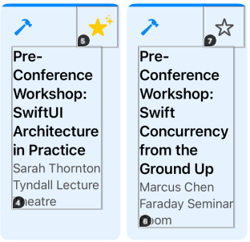
    <figcaption style="font-size: 0.7em; color: #555;">44ptのタップ領域</figcaption>
  </figure>
  <figure style="margin: 0; text-align: center; flex: 0 0 47%;">
    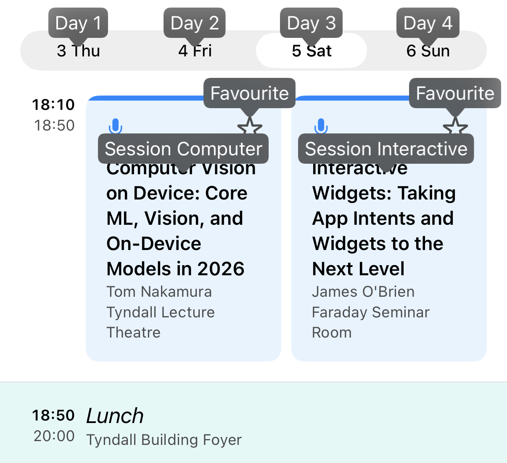
    <figcaption style="font-size: 0.7em; color: #555;">Voice Controlの呼び名表示</figcaption>
  </figure>
</div>

## 最後に

あなたのアプリは、VoiceOverでどう読み上げられるでしょうか。文字サイズを最大にしたとき、レイアウトは崩れずに情報を届けられるでしょうか。MythConfがそうだったように、見た目は完成していても、使い方を変えた瞬間に「辿り着けない情報」が生まれているかもしれません。

とはいえ、会社プロダクトはマーケットを見て動くものであり、アクセシビリティ対応の優先度が上がりにくいのも事実です。しかし、振り返ってみてください。`accessibilityLabel` の組み立ても `ViewThatFits` への置き換えも、術さえ知っていれば数行の実装でした。**コストが高いから後回しになるのではなく、知らないから高くついて見えるだけ**——だからこそ、対応の術を知っていること自体に大きな価値があると私は考えています。

その価値は、今後さらに増していきます。近年、AIがユーザーに代わって画面を読み取り操作する際、VoiceOverと同じアクセシビリティツリーを手がかりにすることがあります。支援技術へ正しい情報を渡せているアプリは **AIにとっても扱いやすいアプリ** になる——アクセシビリティ対応は、AI時代への備えでもあるのです。

アクセシビリティ対応は、特別な誰かのための機能追加ではありません。OSの支援技術へ正しい情報を渡し、コントラストやタップ領域のように **実装でしか担保できない領域** へ目を配る——**誰もが・どんな状況でも、必要とする情報に辿り着ける** ための実装品質そのものです。極論を言えば、画面回転やiPhone・iPad・Vision Proといった各デバイス・各サイズへの対応も、この一点に地続きです。

本記事で挙げた施策は、どれも明日から1つずつ取り入れられます。まずは自分のアプリでVoiceOverをオンにし、Dynamic Typeを最大まで上げて、端から端まで触ってみてください。冒頭の2つの問いの答えと、直したくなる場所が、きっと見つかるはずです。

---

<div style="display: flex; align-items: center; gap: 24px; flex-wrap: wrap;">
  <div style="flex: 0 0 auto; text-align: center;">
    <br>
    <span style="font-size: 0.7em; color: #555;">本記事で解説した実装PR</span>
  </div>
  <div style="flex: 0 0 24px;"></div>
  <div style="flex: 0 0 auto; text-align: center;">
    <br>
    <span style="font-size: 0.7em; color: #555;">iOSDevUK26アプリ (App Store)</span>
  </div>
  <div style="flex: 0 0 auto;">
    <div class="profile-container">
      
      <div class="profile-text-area">
        <div class="profile-text-main">#akidon0000 (あきどん)</div>
      </div>
    </div>
    <div class="profile-text-sub" style="margin-top: 4px;">謝辞：🦌</div>
  </div>
</div>
