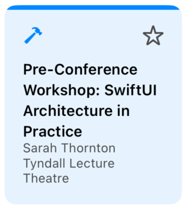
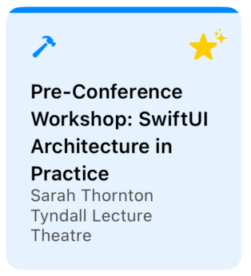
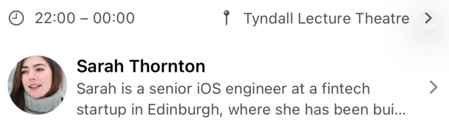
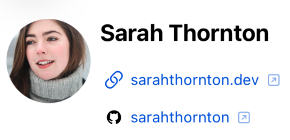

<h1 style="text-align: center;">明日から使える！海外コンペで評価された<br>アクセシビリティ実装ガイド</h1>

<div class="author-info">
  <div class="profile-container">
    
    <div class="profile-text-area">
      <div class="profile-text-main" style="text-align: center;">Sansan株式会社<br>@akidon0000 (あきどん)</div>
    </div>
  </div>
</div>

---

**誰もが・どんな状況でも、必要とする情報に辿り着けること**——それがアクセシビリティ対応の本質だと私は考えています。視覚や聴覚といった身体特性はもちろん、画面の向きやデバイスの違いまで、利用者の置かれた状況はさまざまです。いかなる状況であっても情報に辿り着けるようにする。アクセシビリティ対応は一部のユーザーだけのための特別な対応ではなく、すべての人の使いやすさに直結する「アプリの実装品質」と捉えると良いかもしれません。

iOSには、VoiceOverやDynamic Type、Voice Controlといった強力な支援技術が標準で備わっています。これらは、開発側が意識して対応してこそ、その力を最大限に発揮します。さらに、タップ領域の広さやコントラストのように、標準の支援技術だけでは満たせず、実装側でしか担保できない領域もあります。

本記事では、著者が iOSDevUK カンファレンスにて Accessibility Challenge で優勝した実装を元に、AppleのHuman Interface Guidelinesに沿ってアクセシビリティの解説をします。

## 題材資料：iOSDevUK Accessibility Challenge

<figure style="float: left; margin: 0 20px 8px 0; text-align: center; display: inline-block;">
  
  <figcaption style="font-size: 0.7em; color: #555;">MythConfのProgramme画面</figcaption>
</figure>

iOSDevUK Accessibility Challengeは、MythConf という架空カンファレンスアプリを題材にアクセシビリティを向上を競うコンペティションです。このアプリはMProgramme、Speakers、Locations、My Scheduleの4タブを持ち、アクセシビリティの観点で改善できる箇所が多数存在していました。

ここに本記事の対応を踏まえたPRを日本から送ったところ、主催のRobin Kanatzar氏から次の評とともに優勝の連絡をいただくことができました。

> We had some great pull requests, but his was our favorite.

<div style="clear: both;"></div>


Appleはアクセシビリティ対応のガイドラインを、利用者の特性に応じて大きく5つの領域に分けて定義しており、これは今回の題材としたコンペの評価軸でもありました。本記事も主にこの5つを地図として進めますが、これがすべてではなく、ここに収まりきらない観点も存在します。

- **Vision（視覚）**：見えづらくても情報が伝わるように。
- **Mobility（身体機能）**：細かな操作が難しくても扱えるように。
- **Cognitive（認知）**：迷わず理解できるように。
- **Hearing（聴覚）**：聞こえなくても気づけるように。
- **Speech（発話）**：声を使わなくても操作できるように。

## Vision｜文字サイズに追従する：Dynamic Type

文字サイズの追従は、アクセシビリティ対応の基本といえるでしょう。ユーザーが設定アプリで文字サイズを上げると、`.body` などのテキストスタイルを使っている箇所は自動で拡大されます。このとき考慮すべきなのが、**レイアウトの変化** と **情報量の変化** の2つです。

### レイアウトの変化に対応する

文字サイズが大きくなった際の簡単な対策は「横に収まらなければ縦に積む」ことです。ここで使うのが `ViewThatFits` です。`ViewThatFits` は与えた候補を上から試し、収まる最初のものを採用します。文字サイズの境界（AX1）を待たず、実際にはみ出した瞬間に縦積みへ切り替わるのがポイントです。

> ViewThatFitsは、HStackやVStackなどビューが変化したとしてもビューが作り直されることはなく、パフォーマンスの低下を防ぐとこができます。仮に `if` / `else` の各分岐で実装した場合、サイズが境界を跨ぐたびにビューが丸ごと作り直され、パフォーマンスも低下していたでしょう。

<div style="display: flex; gap: 10px; justify-content: center; align-items: flex-start;">
  <figure style="margin: 0; text-align: center; flex: 1;">
    
    <figcaption style="font-size: 0.7em; color: #555;">横に収まる場合：HStack</figcaption>
  </figure>
  <figure style="margin: 0; text-align: center; flex: 1;">
    
    <figcaption style="font-size: 0.7em; color: #555;">収まらない場合：VStackへ</figcaption>
  </figure>
</div>


```swift
// 時刻と会場：横に入らなければ自動で縦積みに切り替わる
ViewThatFits(in: .horizontal) {
    HStack {
        Label(session.timeRange, systemImage: "clock")
        Spacer()
        NavigationLink(value: locationID) { locationLinkLabel }
    }
    VStack(alignment: .leading) {
        Label(session.timeRange, systemImage: "clock")
        NavigationLink(value: locationID) { locationLinkLabel }
    }
}
```

#### 文字以外もサイズ変化に追従する `@ScaledMetric`

文字サイズに追従するのは「文字」だけではありません。アイコンのサイズ、余白、そして後述するタップ領域も変化させる必要があります。その際には、`@ScaledMetric` が活用できます。

```swift
@ScaledMetric private var starIconSize: CGFloat = 18
@ScaledMetric private var tap[領域]Size: CGFloat = 44
```


### 情報量の変化に対応する

`lineLimit` を使って行数を固定にしている場合、文字サイズによって文字の表示量が変化しユーザーがその画面で得れる情報量に変化が発生する懸念があります。その際には文字サイズに応じて行数を変化させることも検討してみると良いかもしれません。`@Environment(\.dynamicTypeSize)` を見て、見切れを減らしつつ通常時のレイアウトも保つことが可能です。

<div style="display: flex; gap: 10px; justify-content: center; align-items: flex-start;">
  <figure style="margin: 0; text-align: center; flex: 1;">
    
    <figcaption style="font-size: 0.7em; color: #555;">文字サイズ最小（xSmall）での表示</figcaption>
  </figure>
  <figure style="margin: 0; text-align: center; flex: 1;">
    
    <figcaption style="font-size: 0.7em; color: #555;">最大サイズ（AX5）では行数を増やして見切れを防ぐ</figcaption>
  </figure>
</div>

```swift
extension View {
    /// Accessibility サイズ (AX1+) では行数を増やして見切れを防ぐ
    func a11yLineLimit(_ standard: Int, extra: Int = 2) -> some View {
        modifier(A11yLineLimitModifier(standard: standard, extra: extra))
    }
}

private struct A11yLineLimitModifier: ViewModifier {
    @Environment(\.dynamicTypeSize) private var dynamicTypeSize
    let standard: Int
    let extra: Int

    func body(content: Content) -> some View {
        content.lineLimit(dynamicTypeSize.isAccessibilitySize ? standard + extra : standard)
    }
}
```

#### 文字サイズの変化を許容できない際のベストプラクティス

<figure style="float: right; margin: 0 0 8px 20px; text-align: center; display: inline-block;">
  
  <figcaption style="font-size: 0.7em; color: #555;">長押しで拡大ラベルをHUD表示（レイアウトは維持）</figcaption>
</figure>

タブバーやツールバーのように、デザイン上どうしても文字・アイコンを拡大できない要素もあります。とはいえ「小さいまま放置」では、拡大表示を必要とするユーザーがその要素を読めません。そこで使うのが **Large Content Viewer** です。

Large Content Viewerは、アクセシビリティサイズ設定時に対象要素を**長押し**すると、画面中央に拡大したアイコンとラベルをHUDとしてオーバーレイ表示する仕組みです。レイアウトは一切崩さず、必要なときだけ大きく確認できます。標準のタブバーやツールバーはこれに自動対応しており、Appleのアプリで長押しすると拡大ラベルが出るのが確認できます。

カスタムコントロールで同じ挙動を実現したい場合は、`.accessibilityShowsLargeContentViewer` で拡大時に見せる内容を渡します。

```swift
CompactIconButton(systemImage: "star.fill")
    .accessibilityShowsLargeContentViewer {
        Label("Favourite", systemImage: "star.fill")
    }
```

見た目の密度は保ったまま、拡大表示を必要とするユーザーには「長押しで確認できる」逃げ道を用意できます。

<div style="clear: both;"></div>

## Vision｜色による視認性

コントラスト比はコンパイルエラー等は出ず、人間の目視チェックでも人により、なかなか気づきづらいポイントになります。

判定には、Xcodeに付属する **Accessibility Inspector** を使いましょう。「Xcode → Open Developer Tool → Accessibility Inspector」から起動できます。

色を扱う場面では、勘で決めずに必ずAccessibility Inspectorで実測する。これを基本動作にしておくのがおすすめです。

指標としては **WCAG 2.1** が広く使われ、本文テキストは **4.5:1（AA）**、UI部品や大きな文字は **3:1** が下限とされます[^wcag]。

[^wcag]: W3C "Web Content Accessibility Guidelines (WCAG) 2.1" — 達成基準 1.4.3 Contrast (Minimum)、1.4.11 Non-text Contrast。https://www.w3.org/TR/WCAG21/

### システムカラーだからアクセシビリティ大丈夫ではない
`.foregroundStyle(.secondary)`、便利ですよね。私も何の疑いもなく使っていました——実測するまでは。システムの `.secondary` は白背景で約 **3.44:1** と、本文テキストのAA（4.5:1）に届きません。「Appleの色だからアクセシビリティは大丈夫」は必ずしも成り立たないのです。今回は、AAA（7:1）まで余裕を持つ独自トークンを定義し、専用モディファイアでアプリ全体に適用しました。ただし、AAで良しとするかAAAまで目指すかはコストとのトレードオフになるため、チーム内で「どの基準まで満たすか」の共通認識を先にそろえておくことをおすすめします。

さらに他にも `.yellow`や`.mint`などのシステムカラーでもは白背景でのコントラスト比は、それぞれ **約1.5:1**、 **約2.4:1** とUI部品の下限3:1の半分しかありません。色味の印象を保ったまま、AAを満たす値へ置き換えました。

## Vision｜画面を見ずに音で操作する：VoiceOver

VoiceOverは、iOSに標準搭載されたスクリーンリーダーです。画面上の要素を順にフォーカスし、その内容を音声で読み上げることで、画面を見ることなくアプリを操作できます。視覚に障害のあるユーザーだけでなく、運転中や歩行中など「画面を見られない状況」でも使われます。

ただし、VoiceOverは「よしなに読み上げてくれる便利機能」ではありません。何も設計しなければ、ボタンはただ「ボタン」と読まれ、何のボタンかは誰にも分らないでしょう。

VoiceOver対応は何を補足し何を読み上げないかが非常に大切です。それは目による情報密度と音による情報密度には圧倒的な差があり、いかに音による情報密度を上げるかが大切になってきます。

スピーカーのSNSリンクは、URLをそのまま読ませると「github.com スラッシュ alice」のように聞き取りづらくなります。URLのホストとパスを解析してサービスとアカウントを判定し、`accessibilityLabel` を「GitHubアカウント、alice」、未知のドメインなら「Website, example.com」のように組み立てれば、VoiceOverが**リンクの種類を先に**告げてくれます。あわせて `accessibilityInputLabels` に「GitHub」「Twitter」「Tweet」などの言い換えを入れておけば、Voice Controlからも呼び出せます。

<!-- 画像: VoiceOver のフォーカス枠が当たったカード（任意） -->

セッションカードのように複数のテキストが集まった要素は、1つにまとめて読ませた方が圧倒的に速く理解できます。`.accessibilityElement(children: .combine)` でまとめ、`.accessibilitySortPriority` で読み上げ順を制御します。

MythConfのProgrammeカードでは「種別 → タイトル → スピーカー → 会場 → お気に入り」の順に読ませました。長くなりがちなタイトルより先に「これはWorkshopだ／Talkだ」と分かる方が、聞き手の負担が小さいからです。

```swift
var body: some View {
    VStack(spacing: 0) {
        // 種別アイコンや上端ストライプは装飾なので読み上げから除外
        Image(systemName: iconName).accessibilityHidden(true)

        FavouriteButtonView(talk: talk)
            .accessibilitySortPriority(0)        // お気に入りは最後に読む

        NavigationLink(value: reference) { /* タイトル・スピーカー・会場 */ }
            // 「種別, タイトル, by スピーカー, at 会場」を1フレーズに
            .accessibilityLabel("\(kind), \(title), by \(speakers), at \(location)")
            .accessibilitySortPriority(1)        // 本体を先に読む
    }
    .accessibilityElement(children: .contain)    // 本体と星を独立した操作先に
}
```

ここでのコツは `.contain` の使い分けです。`.combine` だと全部が1つのボタンに融合してしまい、カード内の「お気に入り星」を個別に操作できません。`.contain` を使うことで「セッション本体（詳細へ遷移）」と「お気に入り（その場でトグル）」を **2つの独立したフォーカス先** として残しつつ、読み上げ順だけを整えられます。

### 状態が変化した時に、変化後の状態を知らせる


### 地図はApple Mapsに丸投げする

SwiftUIの `Map` は、VoiceOverの観点では非常に厄介です。ピンのパンやズームの読み上げが事実上操作不能で、ここで手が止まってしまいます。発想を変えて、**VoiceOver上では地図を「Apple Mapsを開く1つのボタン」に置き換え**ました。`accessibilityRepresentation` を使うと、見た目はインタラクティブな地図のまま、支援技術にだけ別の表現を渡せます。

```swift
LocationSnapshotMapView(location: location, coordinate: coordinate)
    .accessibilityRepresentation {
        // 複雑な地図のa11yツリーを、Apple Mapsを開く単一ボタンに置換
        Button("") { openInMaps() }
            .accessibilityLabel(Text("Open in Maps: \(location.name)"))
            .accessibilityInputLabels(["Map", "Directions", location.name])
    }
```

晴眼ユーザーには通常の地図、VoiceOver／Switch Controlユーザーには使い慣れたApple Mapsへのハンドオフ。どちらの体験も犠牲にしません。餅は餅屋、地図は純正に任せるのが最善だと考えています。

### 状態は色だけでなく「形」でも伝える

状態の変化を色だけで表現するのは避けるべきデザインです。例えば、下の画像のお気に入りの星を、色を手がかりにせずオンかオフか即座に判断できるでしょうか？黄色という色だけでオン／オフを示すと、黄色を判別しづらいユーザーには伝わらない可能性があります。

そこで、オン時は塗りつぶし（`star` → `star.fill`）へ変えたうえで、`sparkles` を重ねました。色・塗り・パーティクルの三重で「お気に入り済み」が伝わります。ほかにも、オンになった瞬間だけ発生するアニメーションやハプティックフィードバックで補う方法もあるでしょう。

<div style="display: flex; gap: 12px; justify-content: center; align-items: flex-start;">
  <figure style="margin: 0; text-align: center;">
    
    <figcaption style="font-size: 0.7em; color: #555;">オフ：輪郭のみの星（star）</figcaption>
  </figure>
  <figure style="margin: 0; text-align: center;">
    
    <figcaption style="font-size: 0.7em; color: #555;">オン：塗りつぶし＋sparkles（star.fill）</figcaption>
  </figure>
</div>

## Vision & Cognitive｜「押せる」と気づかせる

「ここはタップできる」という手がかりも、色だけに頼らず形で示します。状況によって使い分けるのがコツです。

- **リストのセル**：行末に `chevron.right` を置き、「この行はタップで遷移する」と示す。会場・スピーカー行で使っています。
- **本文中のリンク**：下線で本文と差別化する。
- **本文中のボタン的な要素**：下線が使いにくい箇所では、円形背景つきの矢印（`arrow.up.right.circle.fill` など）で「押せる」と分かるようにする。
- **外部アプリ・外部サイトへ飛ぶ場合**：行末に `arrow.up.right.square` を添えて、「これは別アプリ／別サイトに飛ぶ」と形で予告する。

<div style="display: flex; gap: 10px; justify-content: center; align-items: flex-start;">
  <figure style="margin: 0; text-align: center; flex: 1;">
    
    <figcaption style="font-size: 0.7em; color: #555;">chevronで「タップで遷移」を予告</figcaption>
  </figure>
  <figure style="margin: 0; text-align: center; flex: 1;">
    
    <figcaption style="font-size: 0.7em; color: #555;">外部リンクは矢印アイコンで予告</figcaption>
  </figure>
</div>

リンク色を区別しづらい人にも、操作の意味と遷移先が形で伝わります。

とはいえ、どうしても色を主な手がかりにしたい場面もあるかもしれません。代表例がURLリンクです。近年は下線で本文と差別化するのが主流ですが、それが難しければ青系の色で示すことも検討の余地があります。ボタンのティントカラーのデフォルト値が青であるためユーザーに新たな学習を促す必要がなく、また色覚特性の中で青を見分けづらいタイプの割合は非常に少ないからです。

> URLやボタンの色が青である背景は、iOSDC Japan 2024で発表した [なぜデフォルトが青色！？ Tint Colorの理由に迫る] で詳しく話しています。

## Mobility｜「触れる」ことを保証する

Mobilityは、運動・操作に困難があるユーザーへの配慮です。指先のコントロールが難しい人、外部スイッチやキーボードで操作する人を想定します。

### タップ領域は44×44pt以上

Appleの目安は **44×44pt**。アイコンが小さくても、当たり判定だけは44pt確保します。`@ScaledMetric` と組み合わせると、Dynamic Type拡大時にタップ領域も一緒に広がります。

```swift
Image(systemName: isFavourite ? "star.fill" : "star")
    .frame(width: max(44, tapSize), height: max(44, tapSize))
    .contentShape(.rect)   // 透明部分も含めて44pt全体を当たり判定に
```

`.contentShape(.rect)` を忘れると、アイコンの不透明部分しか反応せず、せっかく広げた枠が効きません。

### ジェスチャには必ず代替を用意する

正確なタップが難しいユーザーのために、Programmeの日付切り替えはセグメントピッカーだけでなく **左右スワイプ** でも行えるようにしました。また `NavigationStack` の **画面端スワイプで戻る** ジェスチャも有効化しています。「ジェスチャでしかできない操作」を作らないのが原則です。

### フルキーボードだけで全機能に届く

Full Keyboard Accessを有効にしたユーザーや外部キーボード派のために、ショートカットを用意しました。面白いのは実装方法で、**画面に表示されない隠しボタン** をキーボードショートカットの受け皿にしています。

```swift
// ⌘1〜4 でタブ移動。小さなタブバーを狙わずに切り替えられる
.background {
    Group {
        Button("Programme") { selectedTab = .programme }
            .keyboardShortcut("1", modifiers: .command)
        Button("Speakers")  { selectedTab = .speakers }
            .keyboardShortcut("2", modifiers: .command)
        // ⌘3 / ⌘4 も同様
    }
    .hidden()
    .accessibilityHidden(true)
}
```

`.background` に置いて `.hidden()` するので、見た目を一切変えずにアプリ全体へショートカットを行き渡らせられます。同じ要領で、検索フィールドへフォーカスする `⌘F`、詳細画面でお気に入りをトグルする `⌘D` も追加しました。

### Voice Controlは「言いそうな言葉」を全部登録する

Voice Controlは画面の表示文字で要素を呼び出しますが、ユーザーが必ずしも表示どおりに言うとは限りません。`.accessibilityInputLabels` に **言い換えの候補** をまとめて登録しておきます。

```swift
.accessibilityInputLabels([
    "Favourite", "Favorite", "Star", "Bookmark",
    "Save", "Add to schedule", "Remove from schedule"
])
```

英米のスペル違い（Favourite / Favorite）から、「Star」「Bookmark」「Save」といった同義語までカバーしておくと、ユーザーは自分の自然な言葉でボタンを押せます。日付ピッカーには「3 Thursday」「Thu」「Day 1」、SNSリンクには「Tweet」やBlueskyの俗称「Skeet」まで登録しました。ユーザーが言いそうな言葉を先回りして拾っておくほど、音声操作は滑らかになります。

<div style="display: flex; gap: 10px; justify-content: center; align-items: flex-start;">
  <figure style="margin: 0; text-align: center; flex: 0 0 42%;">
    
    <figcaption style="font-size: 0.7em; color: #555;">44ptのタップ領域</figcaption>
  </figure>
  <figure style="margin: 0; text-align: center; flex: 0 0 52%;">
    
    <figcaption style="font-size: 0.7em; color: #555;">Voice Controlの呼び名表示</figcaption>
  </figure>
</div>

## Cognitive｜迷わせない・驚かせない

Cognitiveは認知面の配慮です。ここでは特別なAPIはほとんど登場しません。効くのは「わかりやすさ」「一貫性」「予測可能性」という、UI設計の基本そのものです。

### ラベルと語彙の一貫性

- **タブは「3 Thu」「4 Fri」表記**：「Day 1」は順序から自明で冗長、曜日だけだと日付が消える。日付＋曜日を1つに詰めると、頭の中のカレンダーに対応づけやすくなります。
- **同じ操作は同じ言葉**：お気に入りは常に「Favourite / Save / Add to schedule」、地図は常に「Open in Maps」。画面ごとに言い回しを変えません。
- **空状態を明示する**：検索結果ゼロのとき、無言の空リストではなく `ContentUnavailableView` で「該当なし」を晴眼ユーザーにもVoiceOverにも伝えます。

### Reduce Motion：動きを止める

動きに敏感なユーザーがいる可能性も考慮に入れましょう、`@Environment(\.accessibilityReduceMotion)` がオンのときは自動で動く演出を止めます。MythConfには、並行セッションを8秒ごとに切り替えて表示する画面下部のバナーがありますが、Reduce Motion時はこの自動切り替えを停止し、静的なサマリーに切り替えます。

```swift
@Environment(\.accessibilityReduceMotion) private var reduceMotion

private func advanceCycleIfNeeded() {
    // Reduce Motion 中は自動サイクルを止め、画面が勝手に動かないようにする
    guard !reduceMotion, currentTalks.count > 1 else { return }
    withAnimation { cycleIndex = (cycleIndex + 1) % currentTalks.count }
}
```

長いタイトルを流す `MarqueeText` も、Reduce Motion時はスクロールを止めて末尾省略の静的テキストにします。なお、表示が省略されていても **VoiceOverには常に全文を渡す**（`.accessibilityLabel(Text(text))`）ようにしてあり、見た目の都合で情報が欠けることはありません。

## Hearing & Speech｜音に頼らない・声に頼らせない

### Hearing：音だけに頼らず触覚でも伝える

聴覚に配慮するなら、音のフィードバックには触覚を添えます。お気に入りの追加・削除のたびに成功のハプティクスを発火させ、音が聞こえなくても操作の成否が伝わるようにしました。

```swift
.sensoryFeedback(.success, trigger: isFavourite)
```

### Speech：声を使わずに全部操作できる

発話が難しいユーザーは、音声入力に頼れません。前述のフルキーボード対応（⌘1〜4 / ⌘F / ⌘D、Tab・矢印での移動、Space・Enterでの実行）により、声を一切使わずに全機能へ到達できます。

また **Switch Control**（1〜2個のスイッチで操作）への配慮も、これまでの施策がそのまま効きます。地図を単一ボタンに畳んだこと、`.accessibilityElement` で行をまとめてスキャン回数を減らしたこと、`accessibilityRespondsToUserInteraction(false)` で休憩などの非操作要素をスキャン対象から外したこと——いずれもスイッチユーザーの「到達までの手数」を直接削ります。

## アクセシビリティとは別枠の「UX向上」

厳密にはアクセシビリティの枠ではないものの、結果的にすべての人の体験を底上げする工夫もあります。特に効くのが**オフライン地図**です。カンファレンス会場のWi-Fiが不安定なのはもはや前提。そこで `MKMapSnapshotter` で各会場の地図画像をライト／ダーク両方で初回にキャッシュし、`NetworkMonitor` がオフラインを検知したら、インタラクティブな地図の代わりにこのキャッシュ画像を表示します。

```swift
private var shouldShowCache: Bool { !network.isOnline && cachedImage != nil }

// オフライン時はキャッシュ画像 + 「保存済みの地図を表示中」ラベルに切り替え
if shouldShowCache {
    Label("No network — showing a saved snapshot.", systemImage: "wifi.slash")
        .accessibilityElement(children: .combine)
}
```

「道に迷っている、まさにその瞬間に画面が真っ白」という最悪のケースを潰せます。このほか、固定ヘッダーの `.ultraThinMaterial`（Reduce Transparency時はiOSが自動で不透明化）や、`\.locale` 環境を実行時に差し替える多言語化なども、同じ「全員の底上げ」の発想で実装しました。

## まとめ

会社はマーケットを見て動いています。もちろん特定のユーザーのために数十万コストをかけて対応するのはコスパに見合ってないかもしれません。
しかし、アクセシビリティ対応の術を知っていると知っていないでは大きく違うと考えています。そこにビジネスチャンスがあるかもしれません。


アクセシビリティ対応は、特別な誰かのための機能追加ではなく、**実装品質そのもの**です。OSが用意した支援技術に「正しい情報を渡す」こと、そしてコントラストやタップ領域のように **実装でしか担保できない領域** を意識すること。本記事で挙げた施策は、どれも明日からあなたのアプリに1つずつ取り入れられるものばかりです。

そして極論を言えば、**画面回転への対応や、iPhone・iPad・Vision Proといった各デバイス・各サイズへの対応もアクセシビリティです**。横向きで固定されたり、特定のデバイスでレイアウトが破綻したりすれば、その向き・その端末を使う人は情報にたどり着けません。冒頭で述べた「誰もが・どんな状況でも、必要な情報に辿り着けること」へ、Dynamic TypeやVoiceOverもすべて地続きでつながっています。

まずは自分のアプリでVoiceOverをオンにし、Dynamic Typeを最大まで上げて、端から端まで触ってみてください。きっと、直したくなる場所が見つかります。

---

<div style="display: flex; align-items: center; gap: 20px;">
  <div style="flex: 0 0 auto; text-align: center;">
    <!-- 画像: 解説した実装のPR(#4)へのQRコード。後で qr.png を差し替え -->
    <br>
    <span style="font-size: 0.7em; color: #555;">本記事で解説した実装 (PR #4)</span>
  </div>
  <div class="profile-container">
    
    <div class="profile-text-area">
      <div class="profile-text-main">@akidon0000 (Sansan株式会社)</div>
    </div>
  </div>
</div>
