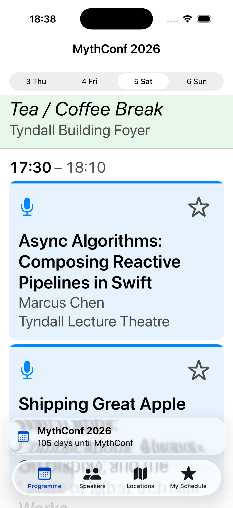
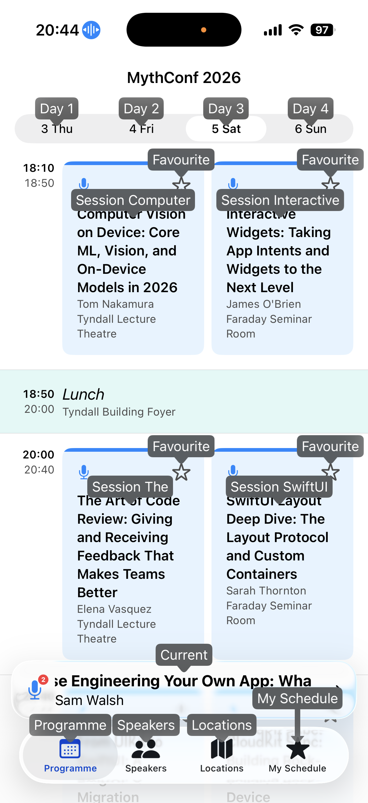

<h1 style="text-align: center;">明日から使える！海外コンペで評価された<br>アクセシビリティ実装ガイド</h1>

<div class="author-info">
  <div class="profile-container">
    
    <div class="profile-text-area">
      <div class="profile-text-main" style="text-align: center;">Sansan株式会社<br>@akidon0000 (あきどん)</div>
    </div>
  </div>
</div>

---

## アクセシビリティ対応の全体像

**誰もが・どんな状況でも、必要な情報に辿り着けること**——それがアクセシビリティの本質だと私は考えています。視覚や聴覚といった身体特性はもちろん、画面の向きやデバイスの違いまで、利用者の置かれた状況はさまざまです。そのどれであっても情報に辿り着けるようにする。本記事のすべての施策は、この一点に向かっています。

だからアクセシビリティ対応は一部のユーザーだけのための特別な対応ではなく、すべての人の使いやすさに直結する「アプリの実装品質」そのものです。iOSには、VoiceOverやDynamic Type、Voice Controlといった強力な支援技術が標準で備わっています。これらは、開発側が意識して対応してこそ、その力を最大限に発揮します。さらに、タップ領域の広さ（Mobility）やコントラストのように、標準の支援技術だけでは満たせず、実装側でしか担保できない領域もあります。

本記事では、iOSDevUK Accessibility Competitionで優勝した実装を、AppleのHIG（Human Interface Guidelines）に沿ってコード中心に解説します。

Appleはアクセシビリティ対応のガイドラインを、利用者の特性に応じて大きく5つの領域に分けて定義しており、これは今回の題材としたコンペの評価軸でもありました。本記事も主にこの5つを地図として進めますが、これがすべてではなく、ここに収まりきらない観点も存在します。

- **Vision（視覚）**：見えづらくても情報が伝わるように。
- **Mobility（身体機能）**：細かな操作が難しくても扱えるように。
- **Cognitive（認知）**：迷わず理解できるように。
- **Hearing（聴覚）**：聞こえなくても気づけるように。
- **Speech（発話）**：声を出さなくても操作できるように。

## 題材：iOSDevUK Accessibility Challenge

解説に使用するのは、カンファレンスのデモアプリ **MythConf**です。Programme、Speakers、Locations、My Scheduleの4タブを持ちます。

<div style="text-align: center;">
  
</div>

---

## Vision｜文字サイズに追従する：Dynamic Type

ユーザーが設定アプリで文字サイズを上げると、`.body` などのテキストスタイルを使っている箇所は自動で拡大されます。問題は **レイアウト** です。横並びのまま文字だけ大きくすると、見切れ・重なり・横スクロールが発生します。

### はみ出したら縦に積む `ViewThatFits`

最大の対策は「横に収まらなければ縦に積む」ことです。たとえばセッション詳細の「時刻＋会場名」の行は、会場名が長いときも文字サイズが大きいときも横に入りきらなくなります。ここで使うのが公式の `ViewThatFits` です。

```swift
// 時刻と会場：横に入らなければ自動で縦積みに切り替わる
ViewThatFits(in: .horizontal) {
    HStack {
        Label(session.timeRange, systemImage: "clock")
        Spacer()
        NavigationLink(value: locationID) { locationLinkLabel }
    }
    VStack(alignment: .leading) {
        Label(session.timeRange, systemImage: "clock")
        NavigationLink(value: locationID) { locationLinkLabel }
    }
}
```

`ViewThatFits` は与えた候補を上から試し、収まる最初のものを採用します。文字サイズの境界（AX1）を待たず、実際にはみ出した瞬間に縦組みへ切り替わるのがポイントです。

> 当初は `@Environment(\.dynamicTypeSize)` を見て `if` で `HStack` / `VStack` を出し分けるカスタムコンテナ（`AStack`）を使っていました。ですが `if` / `else` の各分岐は別々の型を返すため、サイズが境界を跨ぐたびにビューが丸ごと作り直され、状態やアニメーションが保たれずパフォーマンス上も不利です。レイアウト段階で解決する `ViewThatFits` を基本にするのがおすすめです。

### 数値や余白も追従させる `@ScaledMetric`

文字サイズに追従するのは「文字」だけではありません。アイコンのサイズ、余白、そして後述するタップ領域も、`@ScaledMetric` を使えばDynamic Typeに比例して拡大できます。

```swift
@ScaledMetric private var starSize: CGFloat = 18
@ScaledMetric private var tapSize: CGFloat = 44
```

文字だけが大きくなってアイコンが取り残される、という不格好を防げます。

同じく `lineLimit` も、固定すると大きな文字で途切れやすくなります。`@Environment(\.dynamicTypeSize)` を見て、アクセシビリティサイズのときだけ行数を増やすヘルパー（`a11yLineLimit(_:extra:)`）を1つ用意しておくと、見切れを減らしつつ通常時のレイアウトも保てます。

<div style="display: flex; gap: 12px; justify-content: center; align-items: flex-start;">
  <figure style="margin: 0; text-align: center;">
    
    <figcaption style="font-size: 0.7em; color: #555;">xSmall</figcaption>
  </figure>
  <figure style="margin: 0; text-align: center;">
    
    <figcaption style="font-size: 0.7em; color: #555;">AX5（最大サイズ）</figcaption>
  </figure>
</div>

## Vision｜読めるコントラストを実装で担保する

コントラスト比はOSが自動で直してくれない領域の代表格です。指標としては **WCAG 2.1** が広く使われ、本文テキストは **4.5:1（AA）**、UI部品や大きな文字は **3:1** が下限とされます。

### システムカラーは意外と落ちる

ありがちな落とし穴が、`.foregroundStyle(.secondary)` です。システムの `.secondary` は白背景で約 **3.44:1**。本文テキストのAA（4.5:1）を満たしません。そこで、AAA（7:1）まで余裕を持つ独自トークンを定義し、専用モディファイアでアプリ全体に適用しました。

```swift
extension View {
    /// `.foregroundStyle(.secondary)` の代わりに使う。
    /// システムの .secondary は白背景で 3.44:1 しかなく WCAG AA に届かない
    func secondaryTextStyle() -> some View {
        foregroundStyle(Color.textSecondary)   // 白背景 8.47:1 / 黒背景 8.84:1
    }
}
```

ブランドカラー（`AccentColor`）も、ライト／ダークで同じ色のままだと片方で必ずコントラストが不足します。Asset Catalogで明暗を分け、ライトは `#0050D8`（白に6.77:1）、ダークは `#4B9DFF`（黒に7.8:1）を割り当てました。

### システムの `.yellow` / `.mint` は地に溶ける

セッション種別の色分けで `.yellow`（≒#FFCC02）や `.mint`（≒#00C7BE）をそのまま使うと、白背景で **1.5:1 / 2.4:1** 程度しかなく、大きな文字・UI部品の3:1すら下回ります。カードの上端ストライプやアイコンが背景に溶けてしまうのです。色味の印象を保ったまま、AAを満たす値へ置き換えました。

```swift
/// .yellow は白背景で約1.5:1。AA(3:1) を満たす濃いアンバーへ
private static let lightningTalksAccent = Color(red: 0.76, green: 0.54, blue: 0.04) // ≈#C28A0A 3.7:1
/// .mint は白背景で約2.4:1。AA を満たすティールミントへ
private static let lunchAccent = Color(red: 0.02, green: 0.60, blue: 0.54)          // ≈#05998A 3.9:1
```

### 確認方法：Accessibility Inspector を使う

コントラストは目視では判断できません。判定には、Xcodeに付属する **Accessibility Inspector** を使いましょう。「Xcode → Open Developer Tool → Accessibility Inspector」から起動できます。

- **Color Contrast Calculator**：前景色・背景色を入力すると、コントラスト比とAA/AAAの合否がその場で出ます。色を決める前に、まずここへ通す習慣をつけるだけで多くの事故を防げます。
- **Audit**：実機・シミュレータの画面を丸ごと走査し、コントラスト不足のほか、labelの欠落・タップ領域の不足・Dynamic Type非対応などをまとめて検出してくれます。

色を扱う場面では、勘で決めずに必ずAccessibility Inspectorで実測する。これを基本動作にしておくのがおすすめです。

<!-- 画像: Accessibility Inspector のコントラスト計算結果／Audit の検出結果（任意） -->

## Vision｜色だけで状態を伝えない

色覚特性のあるユーザーにとって、「赤＝重要」「黄＝Lightning」のような **色だけの区別** は伝わりません。HIGの "Differentiate Without Color" です。対策はシンプルで、**形（アイコン）や文言を一緒に添える** こと。

MythConfではセッション種別ごとにSF Symbolを割り当てました。WorkshopとTalkはどちらも青系で色だけでは見分けづらいので、形が決定打になります。

```swift
var iconName: String? {
    switch self {
    case .talk:           return "mic.fill"
    case .workshop:       return "hammer.fill"
    case .panel:          return "person.3.fill"
    case .lightningtalks: return "bolt.fill"
    // …休憩や食事などの種別にもアイコンを割り当て、色だけに依存させない
    }
}
```

同じ発想を、状態を表す箇所にも徹底します。お気に入りの星は、黄色という色だけでオン／オフを示すと、黄色を判別しづらいユーザーには伝わりません。そこで、オン時は塗りつぶし（`star` → `star.fill`）へ変えたうえで、`sparkles` を重ねます。色・塗り・パーティクルの三重で「お気に入り済み」が伝わります。

```swift
Image(systemName: isFavourite ? "star.fill" : "star")
    .foregroundStyle(isFavourite ? Color.yellow : Color.textSecondary)
    .overlay(alignment: .topTrailing) {
        if isFavourite {
            Image(systemName: "sparkles") // 色や塗りに加えて「形」でも状態を示す
        }
    }
```

<div style="display: flex; gap: 12px; justify-content: center; align-items: flex-start;">
  
  
</div>

## Vision｜「押せる」と気づかせる

「ここはタップできる」という手がかりも、色だけに頼らず形で示します。状況によって使い分けるのがコツです。

- **リストのセル**：行末に `chevron.right` を置き、「この行はタップで遷移する」と示す。会場・スピーカー行で使っています。
- **本文中のリンク**：下線で本文と差別化する。
- **本文中のボタン的な要素**：下線が使いにくい箇所では、円形背景つきの矢印（`arrow.up.right.circle.fill` など）で「押せる」と分かるようにする。
- **外部アプリ・外部サイトへ飛ぶ場合**：行末に `arrow.up.right.square` を添えて、「これは別アプリ／別サイトに飛ぶ」と形で予告する。

リンク色を区別しづらい人にも、操作の意味と遷移先が形で伝わります。

とはいえ、デザインの都合でどうしても色だけで表現したい場面もあります。代表例がURLリンクです。一般的には下線で本文と差別化しますが、それが難しければ青系の色で示すことも検討の余地があります。ボタンのティントカラーの既定が青であることに加え、色覚特性の中で青が見えづらいユーザーの割合は非常に少ないためです。ただしこれは「他に手がない場合」に限った最終手段と捉え、基本は形や文言を添える前提を崩さないようにします。

> ティントカラーの既定が青である背景は、iOSDC Japan 2024で発表した「[なぜデフォルトが青色！？ Tint Colorの理由に迫る](https://fortee.jp/iosdc-japan-2024/proposal/1b7698c6-31fb-433f-ba71-66ab19c4f14d)」で詳しく話しています。

## Vision｜VoiceOverの読み上げを設計する

ここからが本丸、VoiceOverです。VoiceOverは「読み上げてくれる便利機能」ではなく、**開発者が渡した情報をそのまま読む**だけの存在です。何も設計しなければ、ボタンが「ボタン」とだけ読まれたり、装飾アイコンまで延々読み上げられたりします。

### 要素をまとめ、読み上げ順を決める

セッションカードのように複数のテキストが集まった要素は、1つにまとめて読ませた方が圧倒的に速く理解できます。`.accessibilityElement(children: .combine)` でまとめ、`.accessibilitySortPriority` で読み上げ順を制御します。

MythConfのProgrammeカードでは「種別 → タイトル → スピーカー → 会場 → お気に入り」の順に読ませました。長くなりがちなタイトルより先に「これはWorkshopだ／Talkだ」と分かる方が、聞き手の負担が小さいからです。

```swift
var body: some View {
    VStack(spacing: 0) {
        // 種別アイコンや上端ストライプは装飾なので読み上げから除外
        Image(systemName: iconName).accessibilityHidden(true)

        FavouriteButtonView(talk: talk)
            .accessibilitySortPriority(0)        // お気に入りは最後に読む

        NavigationLink(value: reference) { /* タイトル・スピーカー・会場 */ }
            // 「種別, タイトル, by スピーカー, at 会場」を1フレーズに
            .accessibilityLabel("\(kind), \(title), by \(speakers), at \(location)")
            .accessibilitySortPriority(1)        // 本体を先に読む
    }
    .accessibilityElement(children: .contain)    // 本体と星を独立した操作先に
}
```

ここでのコツは `.contain` の使い分けです。`.combine` だと全部が1つのボタンに融合してしまい、カード内の「お気に入り星」を個別に操作できません。`.contain` を使うことで「セッション本体（詳細へ遷移）」と「お気に入り（その場でトグル）」を **2つの独立したフォーカス先** として残しつつ、読み上げ順だけを整えられます。

### 地図はApple Mapsに丸投げする

SwiftUIの `Map` は、VoiceOverの観点では非常に厄介です。ピンのパンやズームの読み上げが事実上操作不能で、ここで手が止まってしまいます。発想を変えて、**VoiceOver上では地図を「Apple Mapsを開く1つのボタン」に置き換え**ました。`accessibilityRepresentation` を使うと、見た目はインタラクティブな地図のまま、支援技術にだけ別の表現を渡せます。

```swift
LocationSnapshotMapView(location: location, coordinate: coordinate)
    .accessibilityRepresentation {
        // 複雑な地図のa11yツリーを、Apple Mapsを開く単一ボタンに置換
        Button("") { openInMaps() }
            .accessibilityLabel(Text("Open in Maps: \(location.name)"))
            .accessibilityInputLabels(["Map", "Directions", location.name])
    }
```

晴眼ユーザーには通常の地図、VoiceOver／Switch Controlユーザーには「使い慣れた、本当にアクセシブルなApple Maps」へのハンドオフ。両者を犠牲にしない折衷案です。

### URLから意味のあるラベルを組み立てる

スピーカーのSNSリンクは、URLをそのまま読ませると「github.com スラッシュ alice」のように聞き取りづらくなります。URLのホストとパスを解析してサービスとアカウントを判定し、`accessibilityLabel` を「GitHubアカウント、alice」、未知のドメインなら「Website, example.com」のように組み立てれば、VoiceOverが**リンクの種類を先に**告げてくれます。あわせて `accessibilityInputLabels` に「GitHub」「Twitter」「Tweet」などの言い換えを入れておけば、Voice Controlからも呼び出せます。

<!-- 画像: VoiceOver のフォーカス枠が当たったカード（任意） -->

## Mobility｜「触れる」ことを保証する

Mobilityは、運動・操作に困難があるユーザーへの配慮です。指先のコントロールが難しい人、外部スイッチやキーボードで操作する人を想定します。

### タップ領域は44×44pt以上

Appleの目安は **44×44pt**。アイコンが小さくても、当たり判定だけは44pt確保します。`@ScaledMetric` と組み合わせると、Dynamic Type拡大時にタップ領域も一緒に広がります。

```swift
Image(systemName: isFavourite ? "star.fill" : "star")
    .frame(width: max(44, tapSize), height: max(44, tapSize))
    .contentShape(.rect)   // 透明部分も含めて44pt全体を当たり判定に
```

`.contentShape(.rect)` を忘れると、アイコンの不透明部分しか反応せず、せっかく広げた枠が効きません。

### ジェスチャには必ず代替を用意する

正確なタップが難しいユーザーのために、Programmeの日付切り替えはセグメントピッカーだけでなく **左右スワイプ** でも行えるようにしました。また `NavigationStack` の **画面端スワイプで戻る** ジェスチャも有効化しています。「ジェスチャでしかできない操作」を作らないのが原則です。

### フルキーボードだけで全機能に届く

Full Keyboard Accessを有効にしたユーザーや外部キーボード派のために、ショートカットを用意しました。面白いのは実装方法で、**画面に表示されない隠しボタン** をキーボードショートカットの受け皿にしています。

```swift
// ⌘1〜4 でタブ移動。小さなタブバーを狙わずに切り替えられる
.background {
    Group {
        Button("Programme") { selectedTab = .programme }
            .keyboardShortcut("1", modifiers: .command)
        Button("Speakers")  { selectedTab = .speakers }
            .keyboardShortcut("2", modifiers: .command)
        // ⌘3 / ⌘4 も同様
    }
    .hidden()
    .accessibilityHidden(true)
}
```

`.background` に置いて `.hidden()` するので、見た目を一切変えずにアプリ全体へショートカットを行き渡らせられます。同じ要領で、検索フィールドへフォーカスする `⌘F`、詳細画面でお気に入りをトグルする `⌘D` も追加しました。

### Voice Controlは「言いそうな言葉」を全部登録する

Voice Controlは画面の表示文字で要素を呼び出しますが、ユーザーが必ずしも表示どおりに言うとは限りません。`.accessibilityInputLabels` に **言い換えの候補** をまとめて登録しておきます。

```swift
.accessibilityInputLabels([
    "Favourite", "Favorite", "Star", "Bookmark",
    "Save", "Add to schedule", "Remove from schedule"
])
```

英米のスペル違い（Favourite / Favorite）から、「Star」「Bookmark」「Save」といった同義語までカバーしておくと、ユーザーは自分の自然な言葉でボタンを押せます。日付ピッカーには「3 Thursday」「Thu」「Day 1」など、見た目・略記・通称をすべて登録しました。

<div style="display: flex; gap: 12px; justify-content: center; align-items: flex-start;">
  <figure style="margin: 0; text-align: center;">
    
    <figcaption style="font-size: 0.7em; color: #555;">44ptのタップ領域</figcaption>
  </figure>
  <figure style="margin: 0; text-align: center;">
    
    <figcaption style="font-size: 0.7em; color: #555;">Voice Controlの呼び名表示</figcaption>
  </figure>
</div>

## Cognitive｜迷わせない・驚かせない

Cognitiveは認知面の配慮です。専門用語より「わかりやすさ」「一貫性」「予測可能性」が効きます。

### ラベルと語彙の一貫性

- **タブは「3 Thu」「4 Fri」表記**：「Day 1」は順序から自明で冗長、曜日だけだと日付が消える。日付＋曜日を1つに詰めると、頭の中のカレンダーに対応づけやすくなります。
- **同じ操作は同じ言葉**：お気に入りは常に「Favourite / Save / Add to schedule」、地図は常に「Open in Maps」。画面ごとに言い回しを変えません。
- **空状態を明示する**：検索結果ゼロのとき、無言の空リストではなく `ContentUnavailableView` で「該当なし」を晴眼ユーザーにもVoiceOverにも伝えます。

### Reduce Motion：動きを止める

前庭系に敏感なユーザーのために、`@Environment(\.accessibilityReduceMotion)` がオンのときは自動で動く演出を止めます。MythConfには、並行セッションを8秒ごとに切り替えて表示する画面下部のバナーがありますが、Reduce Motion時はこの自動切り替えを停止し、静的なサマリーに切り替えます。

```swift
@Environment(\.accessibilityReduceMotion) private var reduceMotion

private func advanceCycleIfNeeded() {
    // Reduce Motion 中は自動サイクルを止め、画面が勝手に動かないようにする
    guard !reduceMotion, currentTalks.count > 1 else { return }
    withAnimation { cycleIndex = (cycleIndex + 1) % currentTalks.count }
}
```

長いタイトルを流す `MarqueeText` も、Reduce Motion時はスクロールを止めて末尾省略の静的テキストにします。なお、表示が省略されていても **VoiceOverには常に全文を渡す**（`.accessibilityLabel(Text(text))`）ようにしてあり、見た目の都合で情報が欠けることはありません。

## Hearing & Speech｜ボーナスの2カテゴリ

### Hearing：音だけに頼らず触覚でも伝える

聴覚に配慮するなら、音のフィードバックには触覚を添えます。お気に入りの追加・削除のたびに成功のハプティクスを発火させ、音が聞こえなくても操作の成否が伝わるようにしました。

```swift
.sensoryFeedback(.success, trigger: isFavourite)
```

### Speech：声を使わずに全部操作できる

発話が難しいユーザーは、音声入力に頼れません。前述のフルキーボード対応（⌘1〜4 / ⌘F / ⌘D、Tab・矢印での移動、Space・Enterでの実行）により、声を一切使わずに全機能へ到達できます。

また **Switch Control**（1〜2個のスイッチで操作）への配慮も、これまでの施策がそのまま効きます。地図を単一ボタンに畳んだこと、`.accessibilityElement` で行をまとめてスキャン回数を減らしたこと、`accessibilityRespondsToUserInteraction(false)` で休憩などの非操作要素をスキャン対象から外したこと——いずれもスイッチユーザーの「到達までの手数」を直接削ります。

## アクセシビリティとは別枠の「UX向上」

厳密にはアクセシビリティの枠ではないものの、結果的にすべての人の体験を底上げする工夫もあります。特に効くのが**オフライン地図**です。カンファレンス会場のWi-Fiが不安定なのはもはや前提。そこで `MKMapSnapshotter` で各会場の地図画像をライト／ダーク両方で初回にキャッシュし、`NetworkMonitor` がオフラインを検知したら、インタラクティブな地図の代わりにこのキャッシュ画像を表示します。

```swift
private var shouldShowCache: Bool { !network.isOnline && cachedImage != nil }

// オフライン時はキャッシュ画像 + 「保存済みの地図を表示中」ラベルに切り替え
if shouldShowCache {
    Label("No network — showing a saved snapshot.", systemImage: "wifi.slash")
        .accessibilityElement(children: .combine)
}
```

「道に迷っている、まさにその瞬間に画面が真っ白」という最悪のケースを潰せます。このほか、固定ヘッダーの `.ultraThinMaterial`（Reduce Transparency時はiOSが自動で不透明化）や、`\.locale` 環境を実行時に差し替える多言語化なども、同じ「全員の底上げ」の発想で実装しました。

## まとめ

アクセシビリティ対応は、特別な誰かのための機能追加ではなく、**実装品質そのもの**です。OSが用意した支援技術に「正しい情報を渡す」こと、そしてコントラストやタップ領域のように **実装でしか担保できない領域** を意識すること。本記事で挙げた施策は、どれも明日からあなたのアプリに1つずつ取り入れられるものばかりです。

そして極論を言えば、**画面回転への対応や、iPhone・iPad・Vision Proといった各デバイス・各サイズへの対応もアクセシビリティです**。横向きで固定されたり、特定のデバイスでレイアウトが破綻したりすれば、その向き・その端末を使う人は情報にたどり着けません。冒頭で述べた「誰もが・どんな状況でも、必要な情報に辿り着けること」へ、Dynamic TypeやVoiceOverもすべて地続きでつながっています。

まずは自分のアプリでVoiceOverをオンにし、Dynamic Typeを最大まで上げて、端から端まで触ってみてください。きっと、直したくなる場所が見つかります。

---

<div style="display: flex; align-items: center; gap: 20px;">
  <div style="flex: 0 0 auto; text-align: center;">
    <!-- 画像: 解説した実装のPR(#4)へのQRコード。後で qr.png を差し替え -->
    <br>
    <span style="font-size: 0.7em; color: #555;">本記事で解説した実装 (PR #4)</span>
  </div>
  <div class="profile-container">
    
    <div class="profile-text-area">
      <div class="profile-text-main">@akidon0000 (Sansan株式会社)</div>
    </div>
  </div>
</div>
