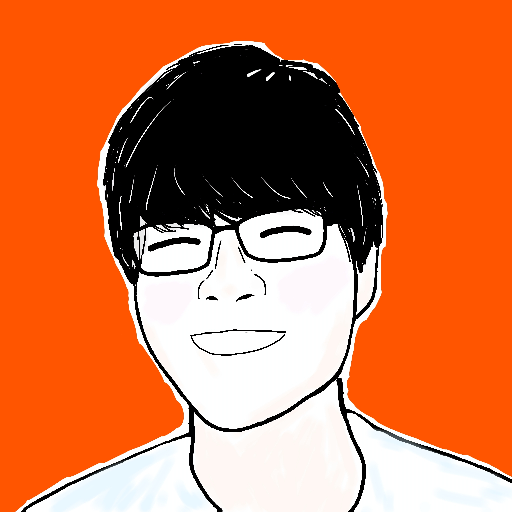

<h1 style="text-align: center;">明日から使える！海外コンペで評価された<br>アクセシビリティ実装ガイド</h1>

<div class="author-info">
  <div class="profile-container">
    
    <div class="profile-text-area">
      <div class="profile-text-main" style="text-align: center;">Sansan株式会社<br>@akidon0000 (あきどん)</div>
    </div>
  </div>
</div>

---

## アクセシビリティ対応の全体像

アクセシビリティ対応は一部のユーザーだけのための特別な対応ではなく、すべての人の使いやすさに直結する「アプリの実装品質」そのものです。iOSには、VoiceOverやDynamic Type、Voice Controlといった強力な支援技術が標準で備わっています。これらは、開発側が意識して対応してこそ、その力を最大限に発揮します。さらに、タップ領域の広さ（Mobility）やコントラストのように、標準の支援技術だけでは満たせず、実装側でしか担保できない領域もあります。逆にいえば、対応すべき「軸」さえ分かっていれば、作業は驚くほど体系立てて進められます。

アクセシビリティは、利用者の特性に応じて大きく5つの領域に分けて考えられます。これはAppleがアクセシビリティ機能を語るときの括りであり、今回の題材としたコンペの評価軸でもありました。本記事もこの地図にそって進みます。

- **Vision（視覚）**：見えづらくても情報が伝わるように。
- **Mobility（身体機能）**：細かな操作が難しくても扱えるように。
- **Cognitive（認知）**：迷わず理解できるように。
- **Hearing（聴覚）**：聞こえなくても気づけるように。
- **Speech（発話）**：声を出さなくても操作できるように。

## 題材：iOSDevUK Accessibility Challenge

本記事のコードは、海外のiOSDevUK Accessibility Challengeにて実装したものを、再利用しやすい形に修正したものです。題材はカンファレンスコンパニオンアプリ **MythConf**（SwiftUI製）。Programme（タイムテーブル）、Speakers、Locations、My Scheduleの4タブを持ちます。

---

## Vision（視覚）

視覚は対応項目がもっとも多いカテゴリです。文字サイズ・コントラスト・色・読み上げの4本柱で見ていきます。

### Dynamic Type：文字が大きくても壊れないレイアウト

ユーザーが文字サイズを上げると（最大のアクセシビリティサイズAX5では標準の約3倍）、固定の余白や横並びレイアウトは簡単に破綻します。

まず、サイズや余白は固定値ではなく `@ScaledMetric` で文字サイズに追従させます。

```swift
struct FavouriteButton: View {
    @ScaledMetric private var iconSize: CGFloat = 22
    var body: some View {
        Image(systemName: "star.fill")
            .frame(width: iconSize, height: iconSize) // 文字サイズに比例して拡大
    }
}
```

横並び（HStack）は、文字が大きくなると横に収まらなくなります。ここで活躍するのが公式の **`ViewThatFits`** です。候補を順に試し、収まる最初のものを採用します。MythConfでは、セッションの「時刻＋会場」の行をこう書きました。

```swift
ViewThatFits(in: .horizontal) {
    HStack {                          // 横に収まればこちら
        Label(session.timeRange, systemImage: "clock")
        Spacer()
        NavigationLink(value: locationID) { locationLinkLabel }
    }
    VStack(alignment: .leading) {     // 収まらなければ縦積みにフォールバック
        Label(session.timeRange, systemImage: "clock")
        NavigationLink(value: locationID) { locationLinkLabel }
    }
}
```

会場名が長いときも、文字サイズが大きいときも、「横に収まらなければ縦」という同じ仕組みで自動的に整います。

> 余談：コンテスト時は `@Environment(\.dynamicTypeSize)` を見て `HStack`↔`VStack` を出し分ける自作コンテナ `AStack` を使っていました。ですが `if`/`else` が返すのは別々の型なので、サイズが境界を跨ぐたびにビューが丸ごと作り直されます。後日エンジニアの指摘で学び、いまはレイアウト段階で解決する `ViewThatFits` を基本にしています。

行の折り返し数も、文字が大きいときだけ増やすと省略が減ります。小さな自作modifierにまとめました。

```swift
extension View {
    func a11yLineLimit(_ standard: Int, extra: Int = 2) -> some View {
        modifier(A11yLineLimitModifier(standard: standard, extra: extra))
    }
}
private struct A11yLineLimitModifier: ViewModifier {
    @Environment(\.dynamicTypeSize) private var dynamicTypeSize
    let standard: Int
    let extra: Int
    func body(content: Content) -> some View {
        content.lineLimit(dynamicTypeSize.isAccessibilitySize ? standard + extra : standard)
    }
}
```

逆に、画面下部へ固定するバナーのように「大きくなりすぎると本文を覆う」要素は、拡大をあえて抑えます。上限を `.dynamicTypeSize(...DynamicTypeSize.large)` で `.large` に制限すれば、極端な拡大からレイアウトが守られます。

そしてタブバーやツールバーといった「chrome」は、レイアウトを保つため、そもそも拡大しません。その代わりiOSには、アクセシビリティ文字サイズのとき項目を **長押しすると内容を画面中央に拡大表示する** Large Content Viewerが用意されています。標準のコントロールは自動で対応しますが、自作のタブバーなどは `.accessibilityShowsLargeContentViewer`（iOS 16以降）で明示的に対応します。

```swift
CustomTabButton(icon: "house.fill", title: "Home")
    // 長押し時に拡大表示する内容（省略すると既存のラベル/画像を使用）
    .accessibilityShowsLargeContentViewer {
        Label("Home", systemImage: "house.fill")
    }
```

<!-- 画像: Dynamic Type xSmall vs AX5 のレイアウト比較／Large Content Viewer の長押し拡大。後で images/ に追加 -->

### コントラスト：システム色を疑い、WCAG基準で作り直す

`.foregroundStyle(.secondary)` は便利ですが、白背景でのコントラスト比は約3.44:1で、WCAG AA（本文4.5:1）を満たしません。そこでAAA（7:1）を満たす独自トークンを定義し、専用modifierで全面的に置き換えました。

```swift
extension View {
    /// .secondary の代わりに使う。.secondary は白背景で 3.44:1 しかなく AA 未達。
    func secondaryTextStyle() -> some View {
        foregroundStyle(Color.textSecondary) // 例：ライト #4D4D4D（8.47:1）
    }
}
```

ブランド色（AccentColor）も、ライトとダークで別々に定義しました。ライトは `#0050D8`（白地6.77:1）、ダークは `#4B9DFF`（黒地7.8:1）とし、どちらのモードでもAAを確保します。

セッション種別の色も見直しました。システムの `.yellow`（≈#FFCC02）は白背景で約1.5:1、`.mint` は約2.4:1と、アイコンの基準3:1に届きません。"らしさ" を保ったままAAを満たす色に差し替えます。

```swift
// 旧: case .lightningtalks: return .yellow   // ≈1.5:1（NG）
case .lightningtalks: return Color(red: 0.76, green: 0.54, blue: 0.04) // ≈3.7:1
case .lunch:          return Color(red: 0.02, green: 0.60, blue: 0.54) // ≈3.9:1
```

コントラスト比は目視で判断せず、ツールで実測します。Xcodeのメニューバー「Xcode → Open Developer Tool → Accessibility Inspector」を開き、画面上の要素を選ぶと、前景色と背景色のコントラスト比とWCAGの合否が表示されます。さらにAudit機能を使えば、コントラスト不足のほか、labelの欠落・タップ領域の不足・Dynamic Type非対応などをまとめて検出できます。

### 色だけに頼らない：形（SF Symbols）で意味を補う

色覚特性にかかわらず情報が伝わるよう、色で区別していた要素には必ず別の手がかりを足します。セッション種別には種類ごとのSF Symbolを割り当てました（TalkとWorkshopは同じ青なので、形が唯一の区別になります）。

```swift
var iconName: String? {
    switch self {
    case .talk:           return "mic.fill"
    case .workshop:       return "hammer.fill"
    case .panel:          return "person.3.fill"
    case .lightningtalks: return "bolt.fill"
    // ...
    }
}
```

お気に入りの星は、色（黄色）だけで状態を示すのではなく、形でも伝えます。アクティブ時は塗りつぶし（`star` → `star.fill`）に変え、さらに `sparkles` を重ねます。これで、黄色を判別しづらいユーザーにも「お気に入り済み」が伝わります。

```swift
Image(systemName: isFavourite ? "star.fill" : "star")
    .foregroundStyle(isFavourite ? Color.yellow : Color.textSecondary)
    .overlay(alignment: .topTrailing) {
        if isFavourite {
            Image(systemName: "sparkles") // 色に加えて「形」でも状態を示す
        }
    }
```

同じ発想で、「押せる」「別アプリが開く」といった状態も、色や下線に頼らず形で示します。

- 会場・登壇者の行末 → `chevron.right`（押せる）
- 外部リンク（SNSなど）の行末 → `arrow.up.right.square`（別アプリが開く）

リンク色を区別しづらい人にも、操作の意味が形で伝わります。

### VoiceOver：読み上げの「粒度」と「順序」を設計する

VoiceOver対応はlabelを付けるだけではありません。「どうグループ化し、どの順で読むか」を設計します。

- 1行に散らばる要素は `.accessibilityElement(children: .combine)` でまとめ、スワイプ回数を減らす
- 画面見出しには `.accessibilityAddTraits(.isHeader)` を付け、ローターで見出し移動できるようにする
- 読み上げ順は `.accessibilitySortPriority` で制御する（カードなら「種別 → タイトル → 登壇者 → 会場 → お気に入り」の順）

```swift
HStack { /* 時刻・タイトル・お気に入り… */ }
    .accessibilityElement(children: .combine)
    .accessibilityLabel("\(session.title)、\(speaker.name)、\(venue)")
```

特に効くのが **`accessibilityRepresentation`** です。地図のような「VoiceOverでは操作しづらい複雑なビュー」を、1つのボタンに置き換えてしまいます。MythConfでは、地図を「タップでAppleマップを開く」単一ボタンとして見せ、操作はアクセシブルな純正アプリに委譲しました。

```swift
LocationSnapshotMapView(location: location, coordinate: coordinate)
    .accessibilityRepresentation {
        // 地図の複雑な a11y サブツリーを、1つのボタンに置き換える
        Button("") { openInMaps() }
            .accessibilityLabel(Text("Open in Maps: \(location.name)"))
            .accessibilityInputLabels(["Map", "Open in Maps", "Directions", location.name])
    }
```

細かな「触れない・読めない」も潰します。お気に入りの星は `NavigationLink` の中に入れ子で、VoiceOverから触れませんでした。`.accessibilityElement(children: .contain)` で中の要素を独立させ、`.accessibilitySortPriority` が読み順を決めます。これで「セッション本体」と「お気に入り」が、別々のフォーカス対象になります。

```swift
card
    .accessibilityElement(children: .contain) // 中の要素を独立フォーカスに
sessionBody.accessibilitySortPriority(1)      // 本体を先に読む
favouriteButton.accessibilitySortPriority(0)  // お気に入りを後に読む
```

SNSリンクは、ホスト名をそのまま読み上げる代わりにサービス名を読ませます。`SocialBrand` でURLを解析し、`.accessibilityLabel` は「GitHub account」のように組み立てます。

<!-- 画像: VoiceOver の読み上げ順／ローターの Before・After。後で追加 -->

---

## Mobility（身体機能）

手の動きに制約がある人や、キーボード・スイッチ・音声で操作する人に向けた対応です。

### タップ領域は44pt以上を確保する

小さなアイコンは、運動制御が難しい人には押しにくい的になります。HIGが推奨する最小44×44ptを、`@ScaledMetric` と合わせて確保します。見た目を変えずに当たり判定だけ広げるのがコツです。

```swift
@ScaledMetric private var tapSize: CGFloat = 44
// ...
Image(systemName: "star.fill")
    .frame(width: max(44, tapSize), height: max(44, tapSize)) // 最低44pt、文字サイズで拡大
    .contentShape(.rect)                                       // 余白も含めて反応
```

### フルキーボードアクセス：⌘ショートカットで全画面を行き来する

外付けキーボードやスイッチを使う人のために、主要画面へのショートカットを用意します。`keyboardShortcut` を付けた `Button` を `.hidden()` で隠せば、UIを一切変えずにショートカットだけ追加できます。

```swift
Group {
    Button("Programme")   { selectedTab = .programme }.keyboardShortcut("1", modifiers: .command)
    Button("Speakers")    { selectedTab = .speakers   }.keyboardShortcut("2", modifiers: .command)
    Button("Locations")   { selectedTab = .locations  }.keyboardShortcut("3", modifiers: .command)
    Button("My Schedule") { selectedTab = .mySchedule }.keyboardShortcut("4", modifiers: .command)
}
.hidden()
.accessibilityHidden(true)   // 見た目にも読み上げにも出さない
```

同様にSpeakers画面の検索フォーカスに `⌘F`、セッション詳細のお気に入り切替に `⌘D` を割り当てています。

### Voice Control：呼びやすい「別名」を与える

Voice Controlでは、ユーザーが画面の文言を読み上げて操作します。表示名が記号やアイコンだと呼べないので、`accessibilityInputLabels` で複数の呼び名（エイリアス）を登録します。

```swift
// 日付ピッカー（セグメント）の各タブ
.accessibilityInputLabels(pickerInputLabels(for: index)) // 例: ["木曜", "Thursday", "Day 1"]

// SNS リンク：実際のハンドルや「Tweet」などの俗称も登録
.accessibilityInputLabels(link.inputLabels)              // 例: ["GitHub", "@akidon0000"]
```

### ジェスチャの代替：タップでもスワイプでも

ひとつの操作に複数の経路を用意します。日付の切り替えは、タップできるセグメントピッカーに加えて、左右スワイプでも行えます。精密なタップが苦手な人はスワイプを、スワイプが難しい人はピッカーを使えます。実装は `Picker` とページ式の `TabView` を同じ選択状態へ束ねるだけです。OS標準の「端からのスワイプで戻る」も殺しません。

```swift
// ピッカーとページ TabView を同じ選択にバインド → タップでもスワイプでも切替
Picker("Conference day", selection: $selectedDayIndex) { /* 各日 */ }
TabView(selection: $selectedDayIndex) { /* 各日 */ }
    .tabViewStyle(.page(indexDisplayMode: .never))
```

### Switch Control：操作対象でない要素は的から外す

休憩などのタップできない行は、VoiceOverでは読ませつつ、Voice Control / Switch Control / フルキーボードの「移動先」からは外して、無駄な停止を減らします。

```swift
// 休憩行：タップ不可。読み上げは残すが、操作の的からは外す
.accessibilityRespondsToUserInteraction(false)
```

## Cognitive（認知）

情報をシンプルに、予測どおりに保つことで、認知的な負荷を下げます。

### 一貫した語彙と、誤読しない表記

同じ操作は常に同じ言葉で表します（「お気に入り」「Open in Maps」など）。日付は「曜日だけ」では曜日感覚の乏しい人へ不親切なので、日付＋曜日を併記し、"3 Thu"（3日・木）のように示して頭の中のカレンダーと結びつけます。件数表示はString Catalog（`.xcstrings`）の複数形バリアントで `1 session` / `3 sessions` と正しく出し分けます。

### 空状態を明示する

検索結果ゼロを黙って空白にせず、`ContentUnavailableView` で「何が起きていて、次に何ができるか」を伝えます。

```swift
if results.isEmpty {
    ContentUnavailableView.search(text: query) // 「"〇〇" に一致なし」を標準UIで提示
} else {
    List(results) { ... }
}
```

### 現在地を見失わせないタイトル

詳細画面では、本文の上部に大きな見出しを置きます。見出しが流れてはじめて、同じタイトル（登壇者なら顔写真＋名前）を `ToolbarItem(placement: .principal)` でナビゲーションバーへ差し込みます。`.large` の唐突なジャンプや、`.inline` で現在地を見失う感覚を避けられます。本文側の見出しには `.accessibilityAddTraits(.isHeader)` を付け、VoiceOverでも見出しとして扱えます。

### Reduce Motion：動きで読書を邪魔しない

「視差効果を減らす」をオンにしている人には、自動で動く要素を止めます。MythConfでは、進行中セッションを巡回表示するバナーが対象です。`accessibilityReduceMotion` に応じて巡回を止め、静的なサマリーへ切り替えます。スクロールする `MarqueeText` も末尾省略で静止させます。

```swift
@Environment(\.accessibilityReduceMotion) private var reduceMotion
// ...
private func advanceCycleIfNeeded() {
    guard !reduceMotion, currentTalks.count > 1 else { return } // 動かさない
    withAnimation { cycleIndex = (cycleIndex + 1) % currentTalks.count }
}
```

また、シート・アラート・バナーは自動で閉じません。勝手に消えないので、ゆっくり読む人や操作に時間がかかる人も取り残されません。

## Hearing & Speech（聴覚・発話）

### Hearing：音に頼らない確認フィードバック

操作の成否を音だけで伝えると、聞こえない人や消音中の人に届きません。お気に入りの追加／解除には `sensoryFeedback` で触覚を返し、視覚（星＋きらめき）と合わせて多重に伝えます。

```swift
.sensoryFeedback(.success, trigger: isFavourite) // 成功を触覚で通知（音に依存しない）
```

### Speech：声を出さなくても全部できる

発話が難しい人のために、音声入力が必須の操作を作らないことが大切です。前述のフルキーボードアクセス（`⌘1`〜`⌘4` など）とSwitch Control対応により、声を使わずにアプリ全体を操作できます。

## カテゴリに収まらない改善：広い意味でのアクセシビリティ

ここからは、5カテゴリにきれいには収まらない改善です。正直、アクセシビリティと強く結びつかないものもあります。それでも「状況や環境によらず、誰もが快適に使える」という広い意味で見れば、意外と地続きでした。

### オフライン対応の会場マップ

カンファレンス会場は地下や郊外で電波が弱く、通信量・回線速度に制約のある人もいます。地図が真っ白になるのは「行きたい場所にたどり着けない」状態そのものです。そこで `MKMapSnapshotter` で、会場マップを初回起動時に明暗両方ぶん生成・キャッシュします。`NetworkMonitor` がオフラインを検知すると、地図はキャッシュ画像へ切り替わり、あわせて `wifi.slash` アイコンと「オフライン表示中」ラベルを添えます。通信という環境の制約を、アプリ側で吸収する試みです。

### Reduce Transparencyに追従する半透明ヘッダ

My Scheduleの固定ヘッダには `.ultraThinMaterial` を使い、下のリストがうっすら透けるようにしています。Reduce Transparencyをオンにした人には、iOSが自動で不透明な背景へ切り替えます。透過が苦手な人や前庭系に過敏な人を置き去りにしません。これは明確にアクセシビリティ対応です。

### 横向きでのレイアウト調整

横向き（`verticalSizeClass == .compact`）ではナビゲーションバーを隠し、縦のピクセルを最大限コンテンツに使えるようにします。ロービジョンの人や大きな文字サイズを使う人ほど、表示領域の余裕が効きます。会場詳細は、横向きだと地図と説明を左右に並べ、両手持ちのまま一度に見渡せます。

### 日本語ローカライズ

UI文字列に加え、登壇者プロフィールやトーク説明などのデータも日本語化し、`LanguageToggleButton` で `\.locale` を切り替えます。「読めない言語」も、情報へのアクセスを阻むバリアです。`Localizable.xcstrings` と `conf-ja.json` を同期して切り替える作りで、他の言語も翻訳ファイルの追加だけで広げられます。

### 「ひと目で分かる」工夫で認知負荷を下げる

「今どこ・誰・何を見ているか」を覚える負担も、まとめて減らしました。SNSリンクには `SocialBrand` でブランドロゴを表示し、ホスト名を読まなくても判別できます。登壇者詳細ではナビバーに顔写真と名前を出し、複数人を見比べても誰のページか迷いません。進行状況バナーは「会期の何日目か」「進行中のセッション」を示し、頭の中で時間割を照合する手間を省きます。

## 評価されたポイント

応募は10件、技術的に優れたものばかりでした。その中で自分の対応が選ばれた理由を考えると、いくつか思い当たります。これは、これからアクセシビリティに取り組む人にも効く視点だと思います。

- **5カテゴリの網羅**：派手な1機能ではなく、VisionからSpeechまで穴なく対応したこと。アクセシビリティは "全員に届く" ことに価値があり、抜けのない対応ほど効果は高い
- **実機での検証**：VoiceOver・Voice Control・Dynamic Type・Switch Controlを実機でひとつずつ触ったこと。シミュレータでは気づけない読み上げ順や操作の詰まりを直せた
- **細部のこだわり**：日本語ローカライズ（UIと登壇データの両方）、電波の弱い会場を想定したオフライン地図スナップショットなど、"使われる現場" を想像した作り込み

主催のRobin Kanatzar氏からは、次の評をいただきました。

> We had some great pull requests, but his was our favorite.

<!-- [要記入：自分が一番こだわった点／実装中に一番悩んだこと（1段落）] -->

## まとめ：アクセシビリティを「標準の実装品質」に

アクセシビリティは、特別なプロジェクトではなく日々の実装の質そのものです。今日からできる最小セットを挙げておきます。

- 余白・アイコンは `@ScaledMetric`、横並びは `ViewThatFits` で文字サイズに耐えさせる
- `.secondary` を疑い、コントラストはWCAG基準（最低AA 4.5:1）で確認する
- 色で区別する要素には、形（SF Symbols）など色以外の手がかりを足す
- VoiceOverはlabelだけでなく、`combine` ／ `isHeader` ／ `sortPriority` で粒度と順序を設計する
- タップ領域は44pt、`keyboardShortcut` と `accessibilityInputLabels` でキーボード／音声からも操作可能にする
- `accessibilityReduceMotion` を尊重し、自動で動く要素は止める

そして何より、**実機で支援技術を実際に使ってみること**。一度体験すると、コードの直し方が具体的に見えてきます。

<!-- [要記入：今後の展望／読者へのメッセージ（2〜3文）] -->

---

<div style="display: flex; align-items: center; gap: 20px;">
  <div style="flex: 0 0 auto; text-align: center;">
    <!-- 画像: 解説した実装のPR(#4)へのQRコード。後で qr.png を差し替え -->
    <br>
    <span style="font-size: 0.7em; color: #555;">本記事で解説した実装 (PR #4)</span>
  </div>
  <div class="profile-container">
    
    <div class="profile-text-area">
      <div class="profile-text-main">@akidon0000 (Sansan株式会社)</div>
      <div class="profile-text-sub">監修：まつじ</div>
    </div>
  </div>
</div>
